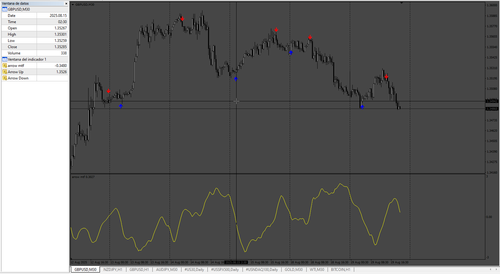
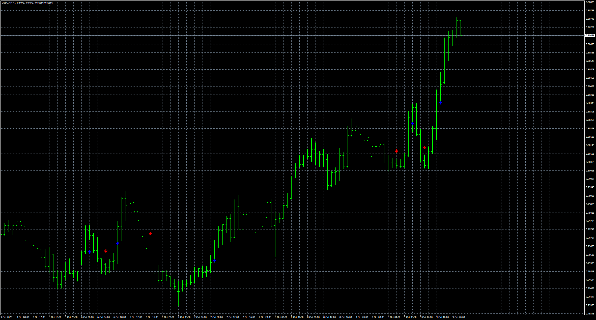

# arrow_mtf_v2

> Source: https://fxcodebase.com/code/viewtopic.php?f=38&t=76258  
> Forum: 38 · Topic 76258 · 9 post(s)

---

## arrow_mtf_v2

**Apprentice** · Thu Aug 21, 2025 3:43 am

TS2 version.
[https://fxcodebase.com/code/viewtopic.p ... 40#p160240](https://fxcodebase.com/code/viewtopic.php?f=17&p=160240#p160240)

 [arrow_mtf_v2.mq4](files/160307/arrow_mtf_v2.mq4)

---

## Re: arrow_mtf_v2

**alphaman** · Thu Sep 04, 2025 11:36 pm

thank you for all your hard work on this forum. It is much appreciated.

1. Can you confirm that this indicator does not repaint please?

2. If it does NOT repaint, could you please add an option to NOT display the chart line in the bottom half of the screen, as I do not follow it. I am only interested in the arrows. thanks.

---

## Re: arrow_mtf_v2

**Apprentice** · Mon Sep 08, 2025 6:03 am

We have added your request to the development list.
Development reference 574

---

## Re: arrow_mtf_v2

**Apprentice** · Tue Sep 23, 2025 3:04 am

 [arrow_mtf_v2_nrp_noline.mq4](files/160589/arrow_mtf_v2_nrp_noline.mq4)

---

## Re: arrow_mtf_v2

**alphaman** · Tue Sep 23, 2025 8:23 am

hi apprentice. thank you very much for taking the time to do this job for me. I am struggling financiallly and with my health as well just now, otherwise, I would send you a donation. am trying to get a system going with this indicator so that I can trade manually with a prop firm on a $5k starting plan, to get some income in for me and my son to survive and keep a roof over our head.

In this regard, can you recommend any good MT4/5 indicators that give arrow alerts on when to open trades please? this indicator looks good on the M15 TF for BTC

---

## Re: arrow_mtf_v2

**Apprentice** · Sat Sep 27, 2025 2:24 pm

Hi Alphaman,

Thanks for your message. I don’t personally use EAs or arrow-based indicators in my own trading, so I don’t have any reliable suggestions to share. In my case, I either place trades manually myself or make use of a copy service.

I wish you the best with your prop firm plan and hope things improve soon for you and your son.

---

## Re: arrow_mtf_v2

**sillymelon** · Wed Oct 01, 2025 5:32 am

> **Apprentice wrote:**
>
>
> Snimka zaslona 2025-09-23 100232.png
>
>
>
>
> arrow_mtf_v2_nrp_noline.mq4

Would like your help to check on this, I've been testing this but it does repaint. The arrows disappeared.

Could you help us to check on it again to ensure that it doesn't repaint please?

Thank you.

---

## Re: arrow_mtf_v2

**Apprentice** · Wed Oct 01, 2025 5:58 am

We have added your request to the development list.
Development reference 605

---

## Re: arrow_mtf_v2

**Apprentice** · Sun Oct 12, 2025 3:54 am

 [arrow_mtf_v2_nrp_noline.mq4](files/160884/arrow_mtf_v2_nrp_noline.mq4)
