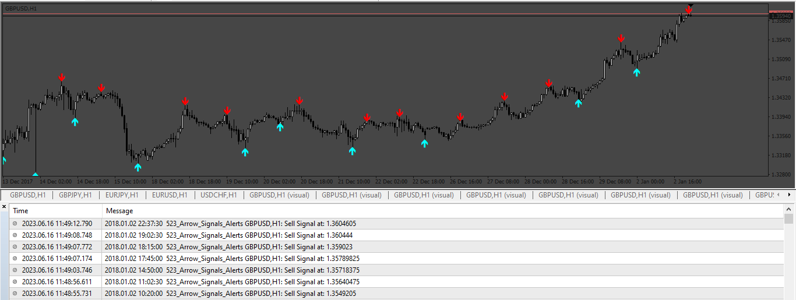
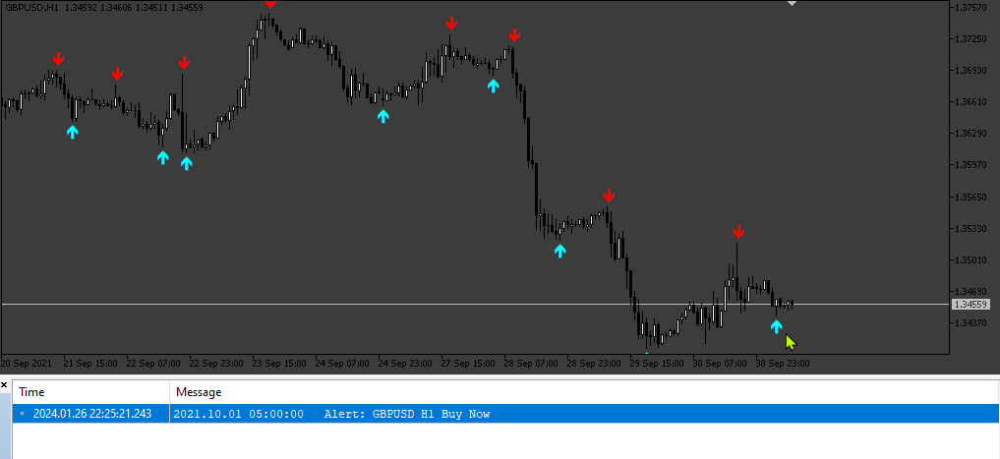
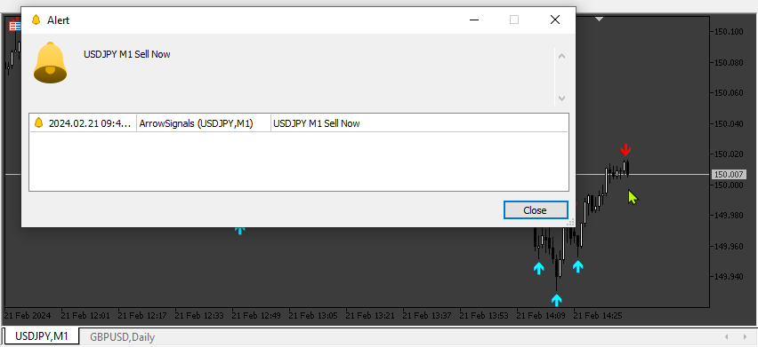

# Arrow_Signals_Alerts

> Source: https://fxcodebase.com/code/viewtopic.php?f=38&t=73847  
> Forum: 38 · Topic 73847 · 7 post(s)

---

## Arrow_Signals_Alerts

**Apprentice** · Tue Jun 20, 2023 12:35 pm

Based on the request.
[https://fxcodebase.com/code/viewtopic.php?f=27&p=151168](https://fxcodebase.com/code/viewtopic.php?f=27&p=151168)

Need to have the original indicator in the folder “Indicators” because only send the .ex4 file

 [ArrowsSignal.ex4](files/151307/ArrowsSignal.ex4)

 [Arrow_Signals_Alerts.mq4](files/151307/Arrow_Signals_Alerts.mq4)

 

 [ArrowSignals.mq5](files/151307/ArrowSignals.mq5)

---

## Re: Arrow_Signals_Alerts

**Imperial_sam** · Sun Jan 21, 2024 3:40 am

Can you provide same thing for MT5 ?

---

## Re: Arrow_Signals_Alerts

**Apprentice** · Tue Jan 23, 2024 2:49 pm

We have added your request to the development list.
Development reference 101

---

## Re: Arrow_Signals_Alerts

**Apprentice** · Thu Feb 01, 2024 12:49 pm

Arrow_Signals_Alerts.mq5 added.

---

## Re: Arrow_Signals_Alerts

**Imperial_sam** · Mon Feb 05, 2024 12:37 am

Thank you so much. But there is not alert forwarder for mt5 indicator. Is it possible that you can create it or if there is already available, please guide me where to find.

---

## Re: Arrow_Signals_Alerts

**Apprentice** · Tue Feb 06, 2024 11:55 am

We have added your request to the development list.
Development reference 111

---

## Re: Arrow_Signals_Alerts

**Apprentice** · Sat Feb 24, 2024 1:36 pm

 [ArrowSignals.mq5](files/154480/ArrowSignals.mq5)
