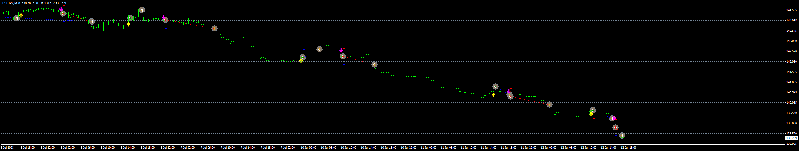

# ASCTrend_EA

> Source: https://fxcodebase.com/code/viewtopic.php?f=38&t=73926  
> Forum: 38 · Topic 73926 · 4 post(s)

---

## ASCTrend_EA

**Apprentice** · Wed Jul 12, 2023 11:26 am

Based on the request.
[https://fxcodebase.com/code/viewtopic.php?f=38&p=151460](https://fxcodebase.com/code/viewtopic.php?f=38&p=151460)

 [ASCTrend1i-Alert.mq4](files/151625/ASCTrend1i-Alert.mq4)

 [ASCTrend_EA_v1.00.mq4](files/151625/ASCTrend_EA_v1.00.mq4)

---

## Re: ASCTrend_EA

**quintana** · Wed Jul 12, 2023 1:08 pm

can you add the fonction
entry logic :direct/reversal
thanks

---

## Re: ASCTrend_EA

**Apprentice** · Thu Jul 20, 2023 2:33 pm

We have added your request to the development list.
Development reference 636.

---

## Re: ASCTrend_EA

**Apprentice** · Wed Jul 26, 2023 11:25 am

Added.

 [ASCTrend_EA_v1.10.mq4](files/151811/ASCTrend_EA_v1.10.mq4)
