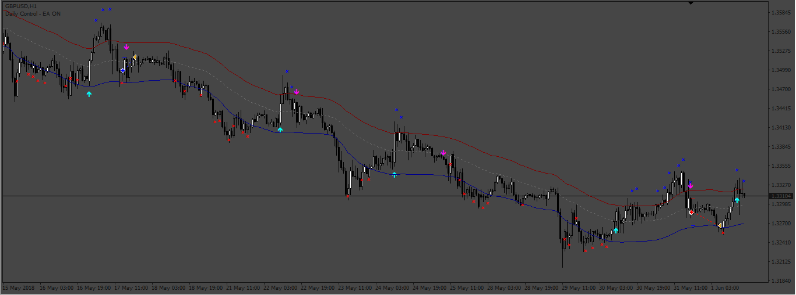
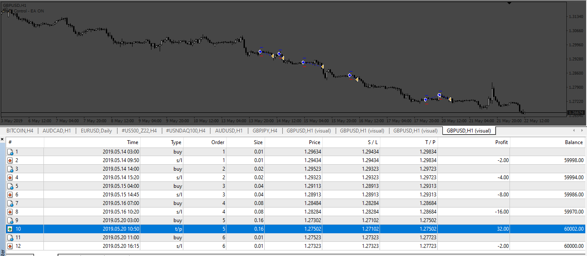

# ascTrend_Tma_EA

> Source: https://fxcodebase.com/code/viewtopic.php?f=38&t=72807  
> Forum: 38 · Topic 72807 · 10 post(s)

---

## ascTrend_Tma_EA

**Apprentice** · Wed Oct 05, 2022 4:30 am

Based on the request.
[https://fxcodebase.com/code/viewtopic.php?f=27&p=147692](https://fxcodebase.com/code/viewtopic.php?f=27&p=147692)

 [asc-trend.mq4](files/147752/asc-trend.mq4)

 [TMA+CG.mq4](files/147752/TMACG.mq4)

 [ascTrend_Tma_EA.mq4](files/147752/ascTrend_Tma_EA.mq4)

---

## Re: ascTrend_Tma_EA

**thiza3062** · Thu Oct 06, 2022 12:52 pm

Thank you, much appreciated

---

## Re: ascTrend_Tma_EA

**PhenomDC** · Fri Oct 14, 2022 4:54 pm

Hello apprentice, please this ea does not work on my mt4. How can i make it work?

---

## Re: ascTrend_Tma_EA

**PhenomDC** · Sun Oct 16, 2022 4:25 pm

Hello Apprentice, hope you are ok. Please could you add breakeven and trailing feature and an input for both.

---

## Re: ascTrend_Tma_EA

**Apprentice** · Tue Oct 18, 2022 1:57 am

We have added your request to the development list.
Development reference 659.

---

## Re: ascTrend_Tma_EA

**Apprentice** · Thu Oct 20, 2022 2:10 am

Version with Breakeven

 [ascTrend_Tma_EA with Breakeven.mq4](files/147976/ascTrend_Tma_EA%20with%20Breakeven.mq4)

---

## Re: ascTrend_Tma_EA

**thiza3062** · Fri Oct 28, 2022 7:08 am

Hello, Apprentice and the team.

I would like to request a martingale feature.
increase lot size on the next signal after a loss

Many thanks

---

## Re: ascTrend_Tma_EA

**Apprentice** · Sun Oct 30, 2022 4:17 am

We have added your request to the development list.
Development reference 686.

---

## Re: ascTrend_Tma_EA

**Apprentice** · Tue Nov 08, 2022 6:52 am

 [ascTrend_Tma_EA_with_Breakeven.mq4](files/148217/ascTrend_Tma_EA_with_Breakeven.mq4)

---

## Re: ascTrend_Tma_EA

**thiza3062** · Fri Nov 11, 2022 10:33 am

Thank you very much
