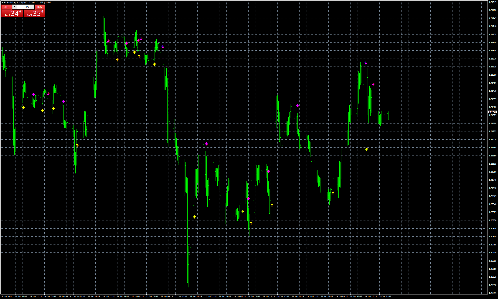

# ASCTrend

> Source: https://fxcodebase.com/code/viewtopic.php?f=38&t=70869  
> Forum: 38 · Topic 70869 · 4 post(s)

---

## ASCTrend

**Apprentice** · Sat Jan 30, 2021 10:19 am

Based on the request.
[viewtopic.php?f=27&t=70841](https://fxcodebase.com/code/viewtopic.php?f=27&t=70841)

 [ASCTrend.mq4](files/140449/ASCTrend.mq4)

---

## Re: ASCTrend

**gravedigger** · Tue Apr 27, 2021 2:10 am

Hello everyone
I have followed the instructions from the website [https://profitrobots.com/Notifications/MTToTelegram](https://profitrobots.com/Notifications/MTToTelegram).
However I have a problem sending the signal to telegram. When I use my home computer, the indicator has an error, MT4 cannot run. When I use computers at my company, the indicator works well. I am not sure where the error is. Hope you help

---

## Re: ASCTrend

**Apprentice** · Tue Apr 27, 2021 6:31 am

Your request is added to the development list.
Development reference 416.

---

## Re: ASCTrend

**Victor.Tereschenko** · Mon May 03, 2021 9:03 am

> **gravedigger wrote:**
> Hello everyone
> I have followed the instructions from the website [https://profitrobots.com/Notifications/MTToTelegram](https://profitrobots.com/Notifications/MTToTelegram).
> However I have a problem sending the signal to telegram. When I use my home computer, the indicator has an error, MT4 cannot run. When I use computers at my company, the indicator works well. I am not sure where the error is. Hope you help

What error do you have?
