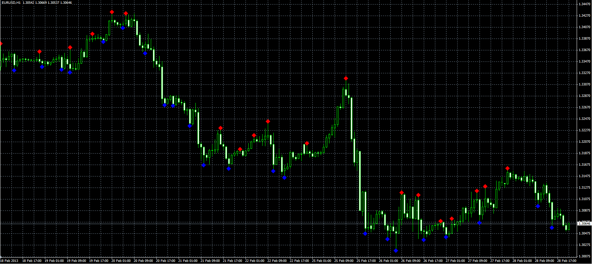

# Asymmetric fractals

> Source: https://fxcodebase.com/code/viewtopic.php?f=38&t=32551  
> Forum: 38 · Topic 32551 · 1 post(s)

---

## Asymmetric fractals

**Alexander.Gettinger** · Thu Feb 28, 2013 5:38 pm

Indicator similar to Advanced Fractal ([viewtopic.php?f=38&t=17244](https://fxcodebase.com/code/viewtopic.php?f=38&t=17244)), but number of bars before and after the fractal specified separately.

 

Download:

 [AsymmetricFractals.mq4](files/55448/AsymmetricFractals.mq4)
