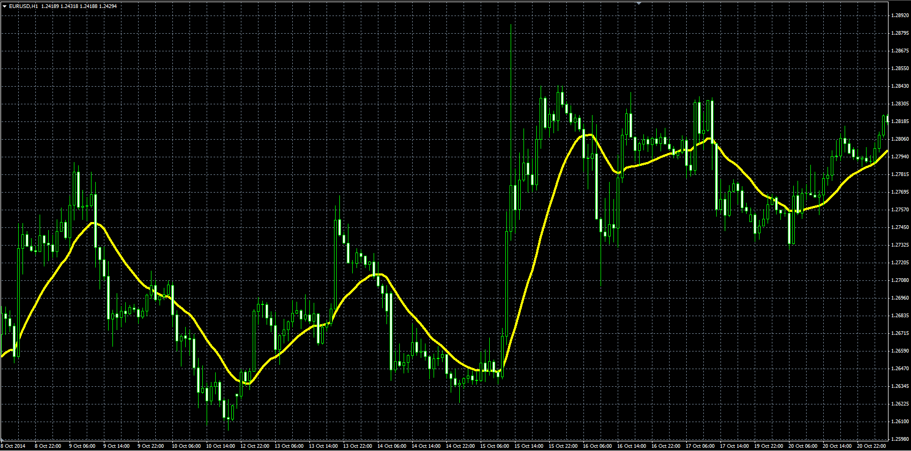

# Asymmetric Linear Weighted Moving Average

> Source: https://fxcodebase.com/code/viewtopic.php?f=38&t=61536  
> Forum: 38 · Topic 61536 · 1 post(s)

---

## Asymmetric Linear Weighted Moving Average

**Alexander.Gettinger** · Tue Nov 25, 2014 11:06 am

Original LUA indicator: [viewtopic.php?f=17&t=4005](https://fxcodebase.com/code/viewtopic.php?f=17&t=4005).

> The indicator has three modes Regular, Inverse, Asymmetric.
>
> Regular- Behaves as an ordinary LWMA.
> Most of the weight is on the last period.
>
> Inverse
> Most of the weight is on the first period.
>
> Asymmetric
> Most of the weight is on Middle of observed period.
> Beginning and end sections are less represented.
>
> Inverse Asymmetric
> Most of the weight is Beginning and end of observed period.
> Middle section is less represented.

 

Download:

 [ALWMA.mq4](files/97361/ALWMA.mq4)
