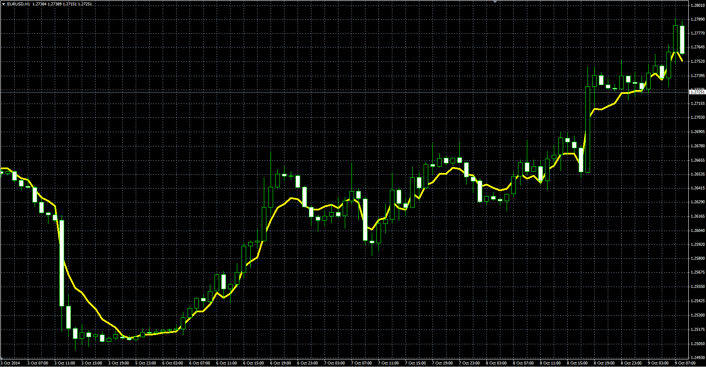

# Asymmetric Moving Average

> Source: https://fxcodebase.com/code/viewtopic.php?f=38&t=61374  
> Forum: 38 · Topic 61374 · 2 post(s)

---

## Asymmetric Moving Average

**Alexander.Gettinger** · Thu Oct 23, 2014 10:13 am

Original LUA indicator: [viewtopic.php?f=17&t=24459](https://fxcodebase.com/code/viewtopic.php?f=17&t=24459).

 

Download:

 [AMA.mq4](files/96714/AMA.mq4)

---

## Re: Asymmetric Moving Average

**rplust** · Fri Oct 24, 2014 9:11 am

Hi,
could you pls adjust the code so the Indi also plots on the current bar instead of waiting for it to close first.
