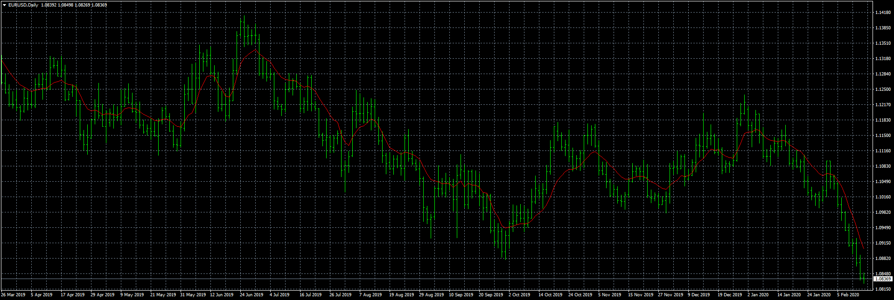

# ATR adaptive EMA

> Source: https://fxcodebase.com/code/viewtopic.php?f=38&t=69409  
> Forum: 38 · Topic 69409 · 5 post(s)

---

## ATR adaptive EMA

**Apprentice** · Fri Feb 14, 2020 8:48 am

Based on TS2/Lua version.
[viewtopic.php?f=17&t=66643](https://fxcodebase.com/code/viewtopic.php?f=17&t=66643)

 [ATR adaptive EMA.mq4](files/131277/ATR%20adaptive%20EMA.mq4)

---

## Re: ATR adaptive EMA

**jshbrgs07** · Tue Feb 18, 2020 10:01 am

Is it possible to add the option where I can apply it to other indicators?

Thanks!

---

## Re: ATR adaptive EMA

**Apprentice** · Tue Feb 18, 2020 10:31 am

Your request is added to the development list.
Development reference 744.

---

## Re: ATR adaptive EMA

**Apprentice** · Fri Feb 21, 2020 6:40 am

It's impossible to make a universal solution in MT4, Only FXTS2 can do so. Every indicator needs to be hardcoded into the code on this indicator.

Can you specify the indicator that you what you use?

---

## Re: ATR adaptive EMA

**jshbrgs07** · Fri Feb 21, 2020 8:04 am

Hello,

Thank you for getting back to me. I was hoping I can use it like any other moving average where I can drag it to any indicator and apply to "First Inidcator's Data"

I do not really have any specific Indicator I would want to put it into aside from the Waddah Attar Explosion but I have already requested an MT4 version of Waddah Attar Explosion using the the ATR value for the Deadzone.

Warm regards,
Josh
