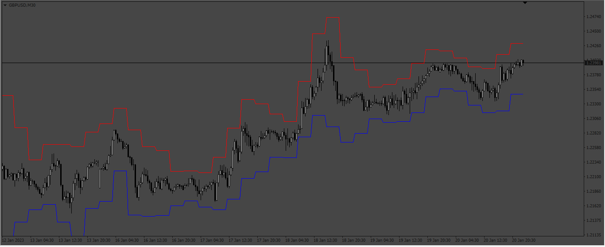
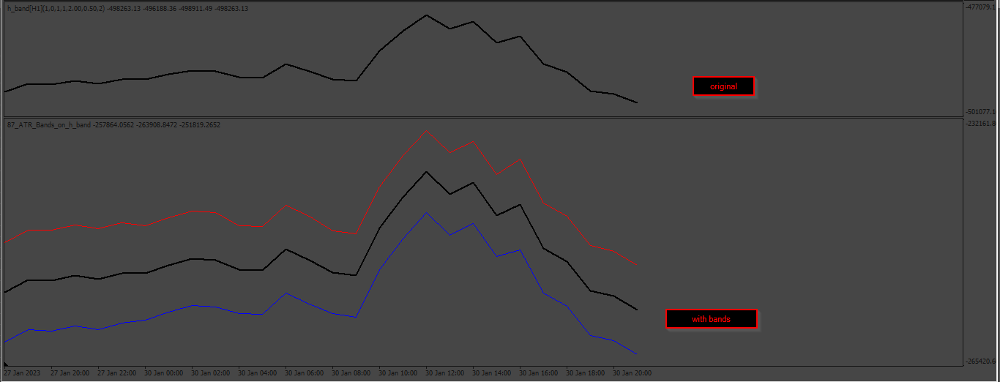
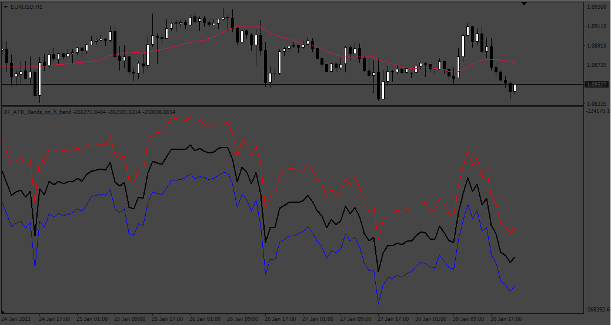
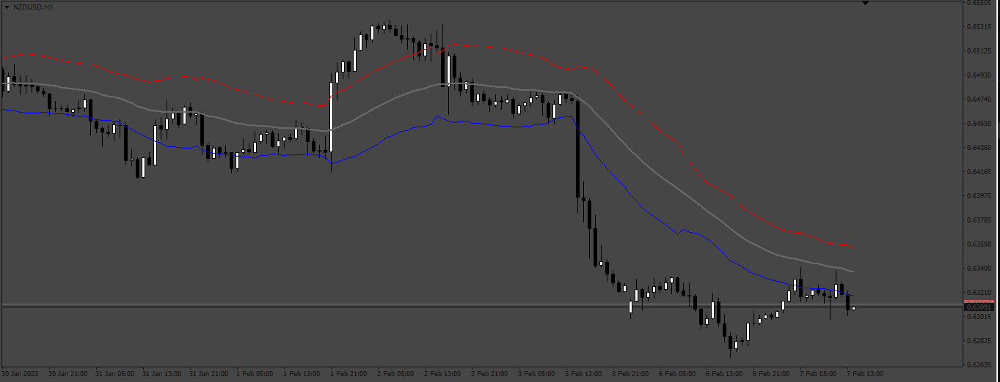
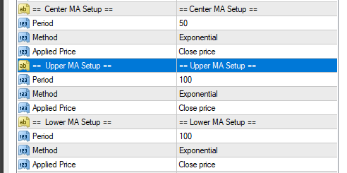

# ATR_Bands_mtf

> Source: https://fxcodebase.com/code/viewtopic.php?f=38&t=73262  
> Forum: 38 · Topic 73262 · 6 post(s)

---

## ATR_Bands_mtf

**Apprentice** · Mon Jan 23, 2023 10:23 am

Based on the request.
[https://fxcodebase.com/code/viewtopic.php?f=27&p=148540](https://fxcodebase.com/code/viewtopic.php?f=27&p=148540)

 [ATR Bands.mq4](files/149249/ATR%20Bands.mq4)

 [ATR_Bands_mtf.mq4](files/149249/ATR_Bands_mtf.mq4)

---

## ATR_Bands_on_h_band

**Apprentice** · Wed Feb 01, 2023 1:54 pm

 

 [ATR_Bands_on_h_band.mq4](files/149440/ATR_Bands_on_h_band.mq4)

---

## Re: ATR_Bands_mtf

**Apprentice** · Fri Feb 10, 2023 8:22 am

Based on the request.
[https://fxcodebase.com/code/viewtopic.php?f=27&t=72997](https://fxcodebase.com/code/viewtopic.php?f=27&t=72997)

 [ATR_Bands_MTF.mq4](files/149588/ATR_Bands_MTF.mq4)

---

## Re: ATR_Bands_on_h_band

**branesuraj** · Wed Jul 31, 2024 5:55 am

> **Apprentice wrote:**
>
>
> 87pic.png
>
>
>
>
> 87pic2.png
>
>
>
>
> ATR_Bands_on_h_band.mq4

can MA Period be added on topline and bottom with extern input for slowing?

---

## Re: ATR_Bands_mtf

**Apprentice** · Wed Jul 31, 2024 3:18 pm

We have added your request to the development list.
Development reference 615

---

## Re: ATR_Bands_mtf

**Apprentice** · Sat Aug 10, 2024 7:49 pm

 [ATR_Bands_MTF_v2.mq4](files/156387/ATR_Bands_MTF_v2.mq4)
