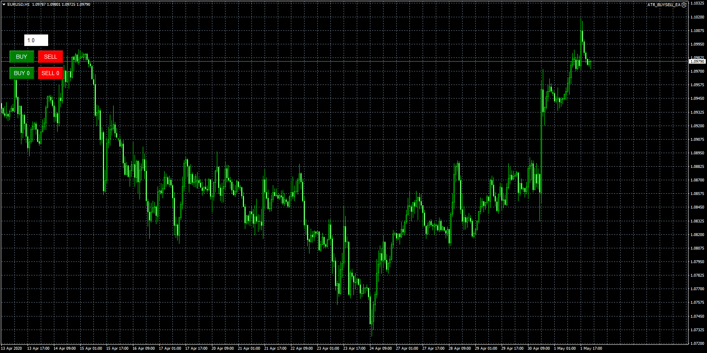

# ATR_BUYSELL_EA

> Source: https://fxcodebase.com/code/viewtopic.php?f=38&t=69787  
> Forum: 38 · Topic 69787 · 9 post(s)

---

## ATR_BUYSELL_EA

**Apprentice** · Sat May 02, 2020 4:34 am

Based on request.
[viewtopic.php?f=27&t=69652](https://fxcodebase.com/code/viewtopic.php?f=27&t=69652)

 [ATR_BUYSELL_EA.mq4](files/133454/ATR_BUYSELL_EA.mq4)

---

## Re: ATR_BUYSELL_EA

**dieworm12** · Mon May 04, 2020 5:50 am

Work as intended thank you very much, One thing how can I move this EA to the top right of the chart?

---

## Re: ATR_BUYSELL_EA

**Apprentice** · Tue May 05, 2020 4:30 am

Your request is added to the development list.
Development reference 1222.

---

## Re: ATR_BUYSELL_EA

**Apprentice** · Tue May 05, 2020 7:06 pm

[ATR_BUYSELL_EA_WITH_POSITIONING.mq4](files/133584/ATR_BUYSELL_EA_WITH_POSITIONING.mq4)

Try this version.

---

## Re: ATR_BUYSELL_EA

**dieworm12** · Wed May 06, 2020 2:35 pm

Thank you. There's another thing, after using it I notice the volume size of the trade using EA is a little different from the indicator, like 0.02 - 0.06 difference. Does it use balance or equity to calculate the risk?

---

## Re: ATR_BUYSELL_EA

**Apprentice** · Thu May 07, 2020 4:52 am

We have fixed some issues from the initially posted version.
(NOT the version with POSITIONING )
Can you redownload and test?

---

## Re: ATR_BUYSELL_EA

**dieworm12** · Thu May 07, 2020 2:24 pm

The volume is working perfectly now thanks, but what's the number at the bottom? I think it's kind of buggy also. Sine when I close the EA the number at the bottom doesn't disappear [https://imgur.com/a/HmCuNmJ](https://imgur.com/a/HmCuNmJ) (The 100 at the bottom)

---

## Re: ATR_BUYSELL_EA

**Apprentice** · Fri May 08, 2020 5:23 am

Your request is added to the development list.
Development reference 1248.

---

## Re: ATR_BUYSELL_EA

**Apprentice** · Fri May 15, 2020 7:46 am

[ATR_BUYSELL_EA.mq4](files/133964/ATR_BUYSELL_EA.mq4)

Try this version.
