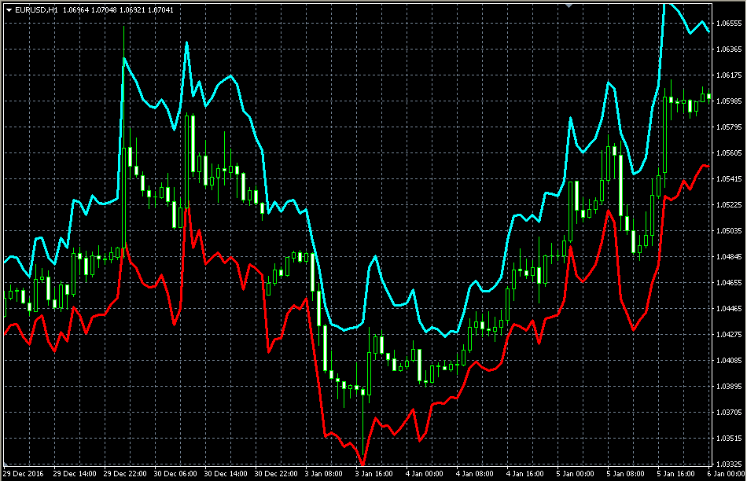

# ATR channel

> Source: https://fxcodebase.com/code/viewtopic.php?f=38&t=64334  
> Forum: 38 · Topic 64334 · 1 post(s)

---

## ATR channel

**Alexander.Gettinger** · Wed Jan 25, 2017 1:13 pm

Formulas:
Upper line=Price+ATR*Multiplier,
Lower line=Price-ATR*Multiplier, where
ATR - average true range with [Length] number of periods.

 

Download:

 [ATR_Channel.mq4](files/110700/ATR_Channel.mq4)
