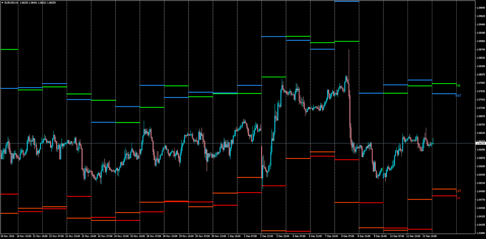

# ATR Levels

> Source: https://fxcodebase.com/code/viewtopic.php?f=38&t=64208  
> Forum: 38 · Topic 64208 · 1 post(s)

---

## ATR Levels

**Apprentice** · Wed Dec 14, 2016 7:51 am

LUA Original: [viewtopic.php?f=17&t=2635](https://fxcodebase.com/code/viewtopic.php?f=17&t=2635)

Description:

LUA to MT4 representation of the following formulas:

H4T line=maximum price for current day+ATR,
L4T line=minimum price for current day-ATR,
H4 line=maximum price for previous day+ATR,
L4 line=minimum price for previous day-ATR,

Where ATR=ATR with ATRPeriod for previous day.

There have also been incorporated the previous days ATR levels to help the trader visualize how the distint levels have been changing each day.

 [ATR_Levels.mq4](files/109931/ATR_Levels.mq4)
