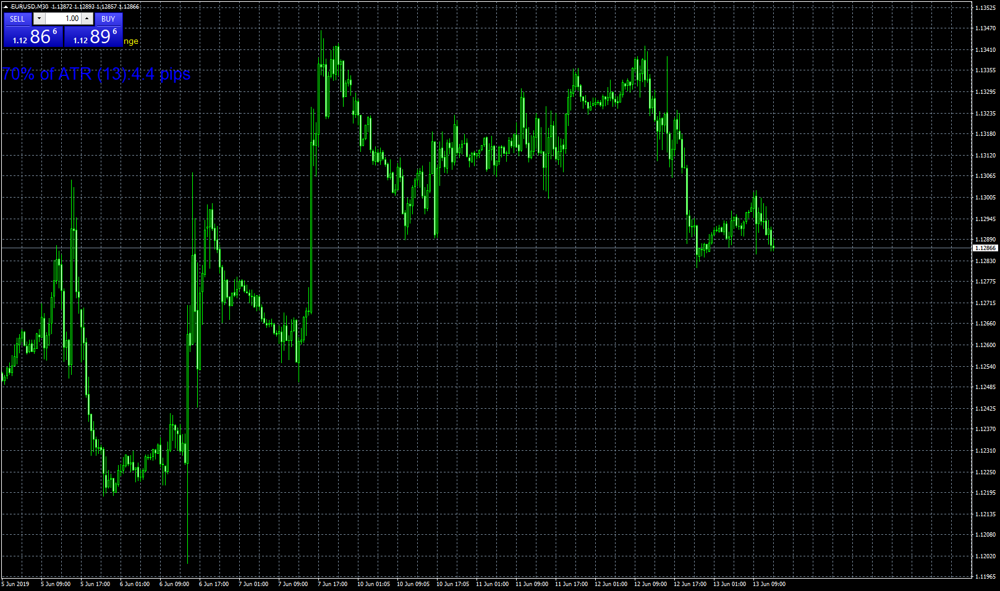

# ATR_pips_Indicator with Alert

> Source: https://fxcodebase.com/code/viewtopic.php?f=38&t=68572  
> Forum: 38 · Topic 68572 · 5 post(s)

---

## ATR_pips_Indicator with Alert

**Apprentice** · Thu Jun 13, 2019 7:09 am

Based on TS2/Lua original.
[viewtopic.php?f=17&t=4971](https://fxcodebase.com/code/viewtopic.php?f=17&t=4971)

 [ATR_pips_Indicator with Alert.mq4](files/126891/ATR_pips_Indicator%20with%20Alert.mq4)

---

## Re: ATR_pips_Indicator with Alert

**annapraven** · Wed Jul 10, 2019 2:32 pm

I have tried to get this alert to work. Am I correct in understanding, it's supposed to give a pop up alert when a candle moves greater than what the selected ATR percentage is? I have played around ith all the settings and can not get a popup to show anywhere. Thanks in advance.

---

## Re: ATR_pips_Indicator with Alert

**Apprentice** · Fri Jul 12, 2019 6:12 am

Fixed.

---

## Re: ATR_pips_Indicator with Alert

**annapraven** · Tue Jul 16, 2019 11:30 am

> **Apprentice wrote:**
> Fixed.

I have updated to version 1.1 and still no matter what I set things at I can not get a popped or sent message to trigger. I made certain DLL was checked off. I have changed the multiplier to various numbers and that appears to change the on chart text. I have tried changing the Alert Level to as low as .5 and left it at 20. In this example the .2 (20 %) was .9 pips and there was a 10 pip move. The alert was also set to .5 which I would assume means 50% of the ATR which would be about 2.2 pips currently well under the 10.

I am trying to get the send to telegram/discord function to work but without even a popup message I can not even be sure a signal is firing. I know you are involved in many threads and really appreciate your work across these boards so I understand if it takes some time. I have just tried everything I can do and am unable to get anything to fire off. Its currently sitting on an IG Metatrader client if that matters.

Thanks in Advance!

---

## Re: ATR_pips_Indicator with Alert

**Apprentice** · Thu Jul 18, 2019 7:23 am

It shows alert only when the previous day has a value lesser than thresold for the alert.
That why it may alert.
