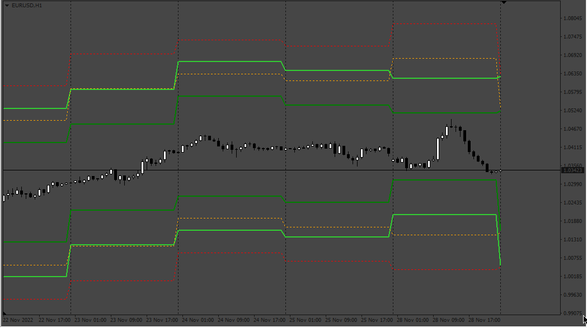
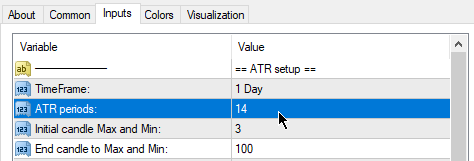
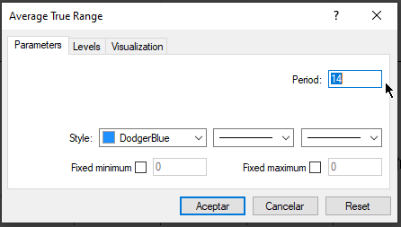

# ATR_TPSL

> Source: https://fxcodebase.com/code/viewtopic.php?f=38&t=72988  
> Forum: 38 · Topic 72988 · 4 post(s)

---

## ATR_TPSL

**Apprentice** · Wed Nov 30, 2022 1:32 pm

Based on the request.
[https://fxcodebase.com/code/viewtopic.php?f=38&t=72970](https://fxcodebase.com/code/viewtopic.php?f=38&t=72970)

 [ATR_TPSL.mq4](files/148500/ATR_TPSL.mq4)

---

## Re: ATR_TPSL

**syncoopate** · Wed Nov 30, 2022 5:04 pm

Hello Apprentice ..we're almost there....
Then I have attached the notes for you ....
AtrPeriod I don't have to insert it in extern but it is calculated between the min and the max of the ATR between 3 and 100(see figure),
then you need to make two ATR set up areas, one for SLB and SLS and one for TPB and TPS with the relative parameters (See figure) I gave you an example on SLB1 AND SLB2 .....
I hope I was clear enough....
Thank you and I look forward to hearing from you.
A hug from Italy Maurizio.

---

## Re: ATR_TPSL

**Apprentice** · Thu Dec 01, 2022 6:02 am

We have added your request to the development list.
Development reference 784.

---

## Re: ATR_TPSL

**Apprentice** · Sat Dec 10, 2022 6:04 am

 

The "ATR Periods" setup is not about the candles, is to input the periods to the ATR Indicator

 [ATR_TPSL.mq4](files/148626/ATR_TPSL.mq4)
