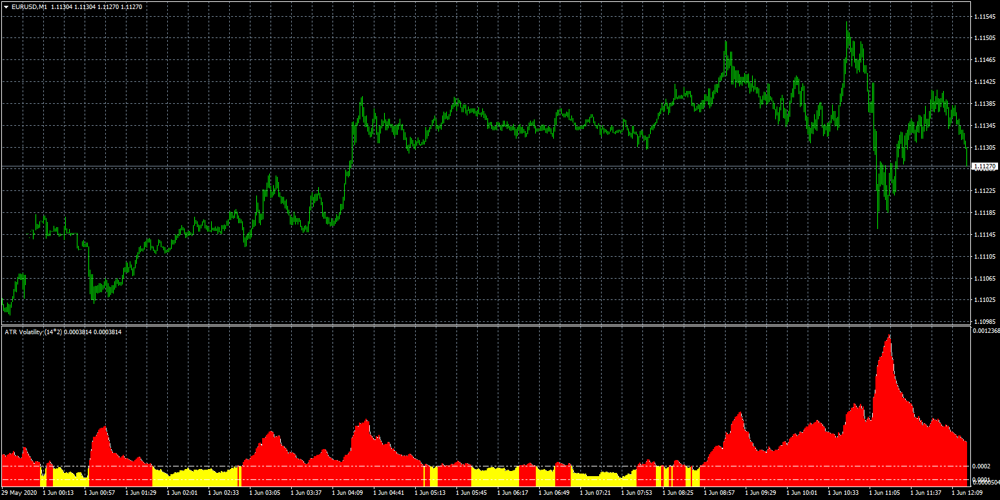

# ATR_Volatility

> Source: https://fxcodebase.com/code/viewtopic.php?f=38&t=69948  
> Forum: 38 · Topic 69948 · 2 post(s)

---

## ATR_Volatility

**Apprentice** · Mon Jun 01, 2020 6:11 am

Based on request.
[viewtopic.php?f=27&t=69921](https://fxcodebase.com/code/viewtopic.php?f=27&t=69921)

 [ATR_Volatility.mq4](files/134485/ATR_Volatility.mq4)

---

## Re: ATR_Volatility

**richard19** · Mon Jun 01, 2020 10:37 am

> **Apprentice wrote:**
>
>
> eurusd-m1-fxcm-australia-pty-2.png
>
>
> Based on request.
> [viewtopic.php?f=27&t=69921](https://fxcodebase.com/code/viewtopic.php?f=27&t=69921)
>
>
> ATR_Volatility.mq4

Thank you very much Mario. Really appreciate your help.

Cheers
Richard
