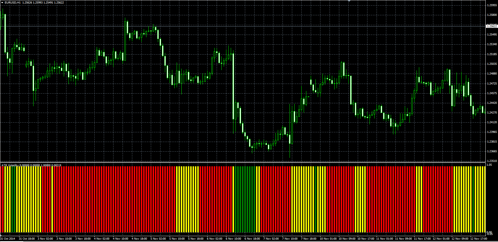

# Atr Volatility

> Source: https://fxcodebase.com/code/viewtopic.php?f=38&t=61494  
> Forum: 38 · Topic 61494 · 1 post(s)

---

## Atr Volatility

**Alexander.Gettinger** · Thu Nov 20, 2014 10:17 am

Original LUA indicator: [viewtopic.php?f=17&t=10451](https://fxcodebase.com/code/viewtopic.php?f=17&t=10451).

> The indicator shows when the ATR value is higher / lower than the default, in pips.
> I added the percentage mode.
> Shows the position of the ATR values ​​within the range of ATR values
> From minimum to maximum, it is calculated for all on on Chart data.

 

Download:

 [ATR_Volatility.mq4](files/97223/ATR_Volatility.mq4)
