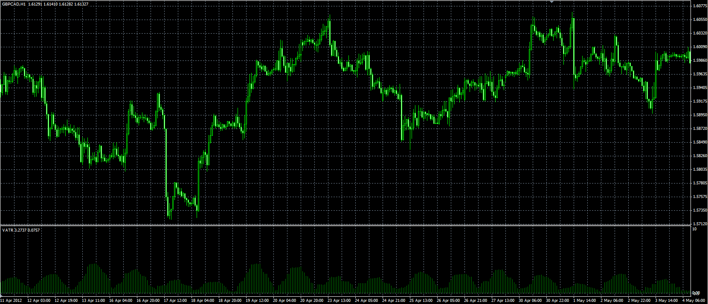

# ATR with volume (VATR)

> Source: https://fxcodebase.com/code/viewtopic.php?f=38&t=17981  
> Forum: 38 · Topic 17981 · 1 post(s)

---

## ATR with volume (VATR)

**Alexander.Gettinger** · Tue May 08, 2012 5:04 pm

Original indicator: [viewtopic.php?f=17&t=15506&p=29210](https://fxcodebase.com/code/viewtopic.php?f=17&t=15506&p=29210)

> Formulas:
> VATR=Average(TR[i]*Volume[i]), where
> TR - true range, TR[i]=Max(High[i]-Low[i], High[i]-Close[i-1], Close[i-1]-Low[i]).

 

Download:

 [VATR.mq4](files/32536/VATR.mq4)
