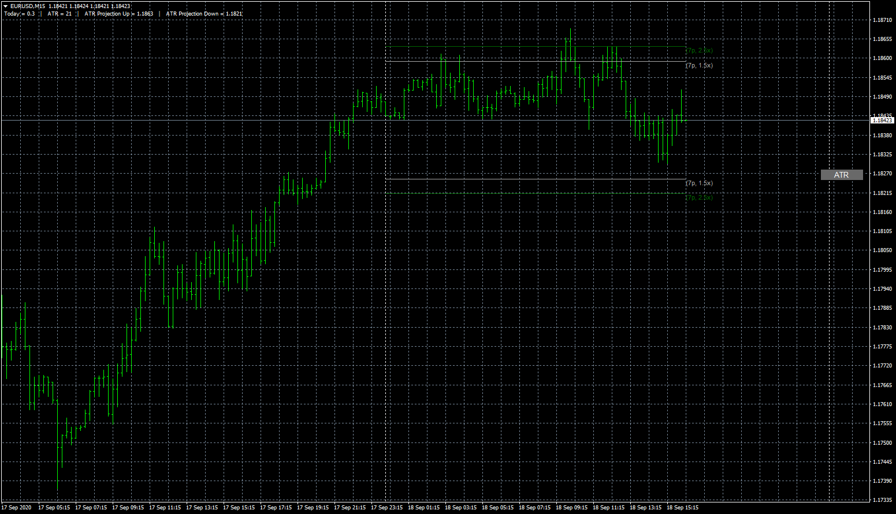

# ATRprojections button

> Source: https://fxcodebase.com/code/viewtopic.php?f=38&t=70458  
> Forum: 38 · Topic 70458 · 11 post(s)

---

## ATRprojections button

**Apprentice** · Fri Sep 18, 2020 8:16 am

Based on request.
[viewtopic.php?f=27&t=70260](https://fxcodebase.com/code/viewtopic.php?f=27&t=70260)

 [ATRprojections button.mq4](files/137731/ATRprojections%20button.mq4)

---

## Re: ATRprojections button

**Lumios** · Sat Oct 03, 2020 11:42 am

Perfect, thank you!

---

## Re: ATRprojections button

**Lumios** · Mon Oct 05, 2020 4:11 pm

Mario,

Could I ask for a slight modification? Could the lines display over X amount of bars rather than just for the current day? The lines are very small/not visible when the new day starts.

Ryan

---

## Re: ATRprojections button

**Apprentice** · Tue Oct 06, 2020 2:16 am

Your request is added to the development list.
Development reference 2149.

---

## Re: ATRprojections button

**Apprentice** · Mon Nov 09, 2020 5:34 pm

[ATRprojections_button_ver1.mq4](files/138777/ATRprojections_button_ver1.mq4)

Something like this?

---

## Re: ATRprojections button

**Hammertop** · Tue Jul 19, 2022 8:12 am

Hello. I just found this forum by chance. Glad I did, and thanks for making this stuff available. I also find it fair to support the site and I will do it asap. I've been looking for quite some time for a modification to this indicator original code, but what I found here surely I wasn't expecting. Thanks very much. It seems though that the latest version calculates the ATR on the current TF. Could you kindly add an option to select the TF, please? That way the value will remain the same as in the original, no matter the chart TF. I would be eternally grateful if you did it.

---

## Re: ATRprojections button

**Apprentice** · Wed Jul 20, 2022 7:12 am

We have added your request to the development list.
Development reference 433.

---

## Re: ATRprojections button

**Hammertop** · Thu Jul 21, 2022 1:43 am

> **Apprentice wrote:**
> We have added your request to the development list.
> Development reference 433.

Thank you very much for considering my request. Can I possibly modify it? Would it be possible to actually turn the button rather than ON-OFF into an object to choose both the TF and the average number, in order to modify them on the fly? I personally use a saved template with the indi loaded and I think the button just to switch it on and off is actually redundant. Thank you very much again.

---

## Re: ATRprojections button

**Apprentice** · Thu Jul 21, 2022 2:22 pm

We have added your request to the development list.
Development reference 441.

---

## Re: ATRprojections button

**Apprentice** · Thu Aug 18, 2022 8:01 am

[ATRprojections_button_ver2.mq4](files/147144/ATRprojections_button_ver2.mq4)

Try this version.

---

## Re: ATRprojections button

**Apprentice** · Wed Aug 31, 2022 5:26 am

Task 441

 [ATRprojections_button_ver3.mq4](files/147294/ATRprojections_button_ver3.mq4)
