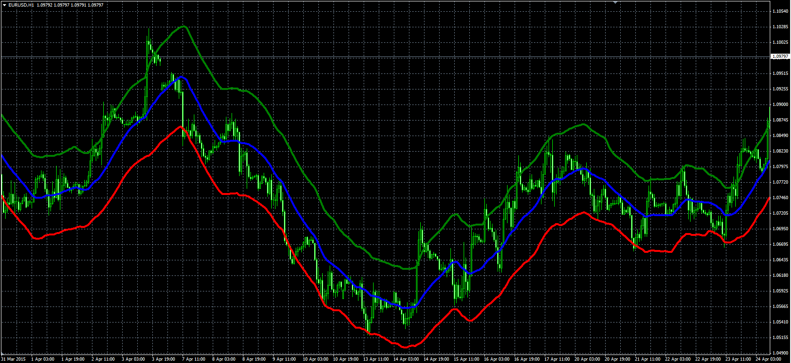

# Auto Envelope

> Source: https://fxcodebase.com/code/viewtopic.php?f=38&t=62161  
> Forum: 38 · Topic 62161 · 1 post(s)

---

## Auto Envelope

**Alexander.Gettinger** · Wed Apr 29, 2015 1:03 pm

Original LUA indicator: [viewtopic.php?f=17&t=61315](https://fxcodebase.com/code/viewtopic.php?f=17&t=61315).

Formulas:
Central = MA(Close) with [Length] number of periods and [Method] type,
Top = Central+Channel/2,
Bottom = Central-Channel/2, where
Channel = StdDev*Factor*Central/10,
StdDev - standard deviation(Raw) with [Deviation_Length] number of periods,
Raw = 2*Max(Abs(High-MA), Abs(Low-MA))/MA.

 

Download:

 [Auto_Envelope.mq4](files/100145/Auto_Envelope.mq4)
