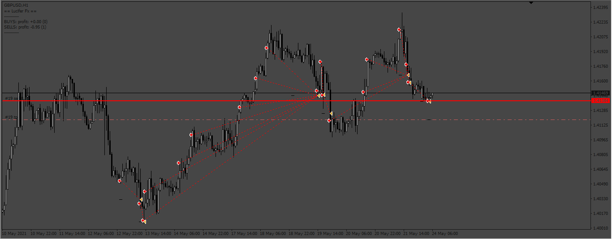
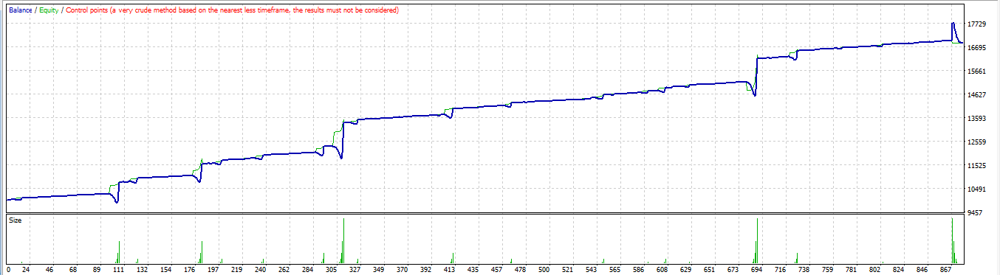
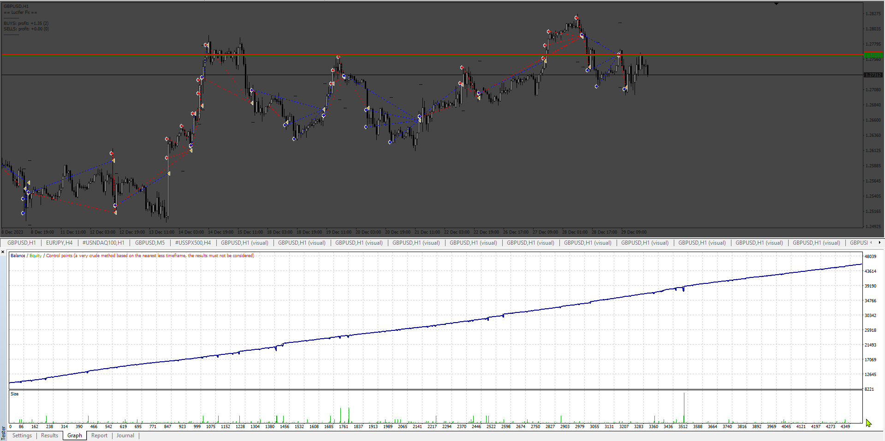
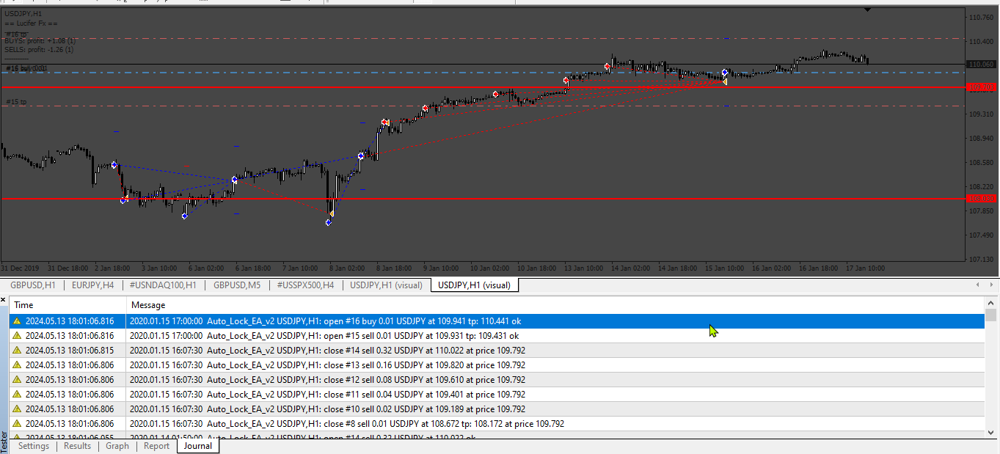
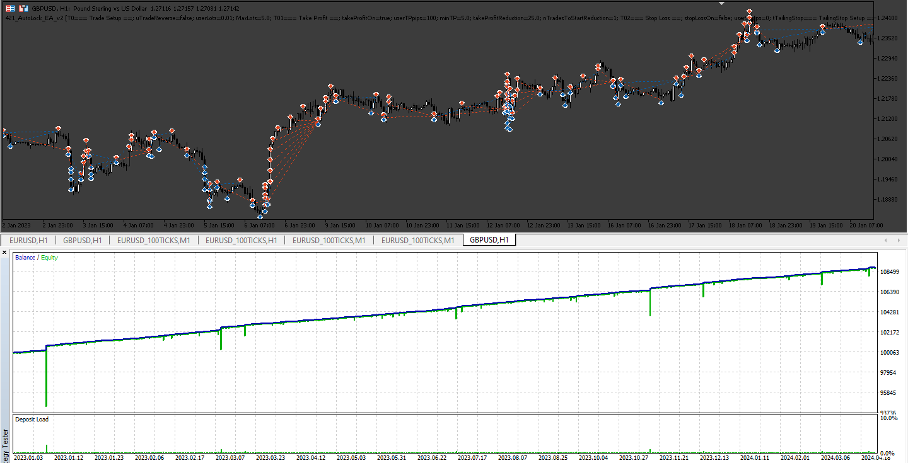

# Auto Lock EA

> Source: https://fxcodebase.com/code/viewtopic.php?f=38&t=72464  
> Forum: 38 · Topic 72464 · 8 post(s)

---

## Auto Lock EA

**Apprentice** · Wed Jul 06, 2022 2:48 am

 

Based on the request
[https://fxcodebase.com/code/viewtopic.php?f=27&p=146305](https://fxcodebase.com/code/viewtopic.php?f=27&p=146305)

 [Auto Lock EA.mq4](files/146625/Auto%20Lock%20EA.mq4)

---

## Re: Auto Lock EA

**jedingthe** · Mon Jul 11, 2022 2:02 pm

Thanks a lot sir...
apologize for late response, I think my request is ignored.

it"s working well, but must be attached one by one on a chart. Not as an example of EA that just put on one chart then the EA will manage all transactions/opened trades (also can filter by manual opened trade only, or all opened trades (EA and Manual).
However, thanks a lot, I believe this is a good tool to help everybody who needs help with their trading.

---

## Re: Auto Lock EA

**kenny22** · Thu May 02, 2024 10:12 am

EA has made multiple price changes to the same order. Please correct it. Thank you.

---

## Re: Auto Lock EA

**Apprentice** · Fri May 10, 2024 6:55 am

We have added your request to the development list.
Development reference 373

---

## Re: Auto Lock EA

**Apprentice** · Fri May 17, 2024 12:17 pm

 

 [Auto_Lock_EA_v2.mq4](files/155360/Auto_Lock_EA_v2.mq4)

---

## Re: Auto Lock EA

**phnthnhnm** · Sun May 19, 2024 8:46 am

Dear Expert,
May I request MT5 of this EA.
Thank you.

---

## Re: Auto Lock EA

**Apprentice** · Wed May 22, 2024 1:57 pm

We have added your request to the development list.
Development reference 421

---

## Re: Auto Lock EA

**Apprentice** · Thu May 30, 2024 12:50 pm

 [AutoLock_EA_v2.mq5](files/155570/AutoLock_EA_v2.mq5)
