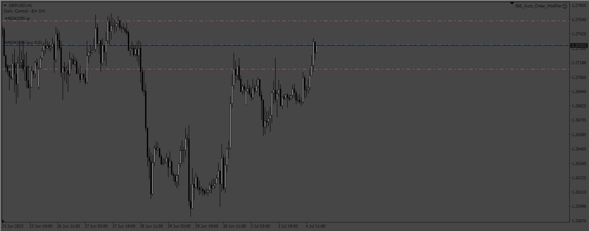

# Auto_Order_Modifier

> Source: https://fxcodebase.com/code/viewtopic.php?f=38&t=73895  
> Forum: 38 · Topic 73895 · 4 post(s)

---

## Auto_Order_Modifier

**Apprentice** · Tue Jul 04, 2023 10:16 am

Based on the request.
[https://fxcodebase.com/code/viewtopic.php?f=38&t=73855](https://fxcodebase.com/code/viewtopic.php?f=38&t=73855)

 [Auto_Order_Modifier.mq4](files/151501/Auto_Order_Modifier.mq4)

---

## Re: Auto_Order_Modifier

**rafiksmith** · Wed May 01, 2024 4:43 pm

Hi
Can you add these features to the EA:

Position sizing
when i open a trade from my mobile ( i'll open always 0.01) it will automatically recalculate the needed lot to meet risk and open another trade with **the same SL**
The risk will be based on **the equity or balance %** which depends on the SL value
It should also include a **Max daily PL**.

Thanks.

---

## Re: Auto_Order_Modifier

**Apprentice** · Fri May 10, 2024 7:03 am

We have added your request to the development list.
Development reference 377

---

## Re: Auto_Order_Modifier

**Apprentice** · Sun Oct 06, 2024 2:49 am

Based on the request.
[https://fxcodebase.com/code/ucp.php?i=p ... ew&p=17651](https://fxcodebase.com/code/ucp.php?i=pm&mode=view&p=17651)

 [Auto_Order_Modifier_v2.mq4](files/156880/Auto_Order_Modifier_v2.mq4)
