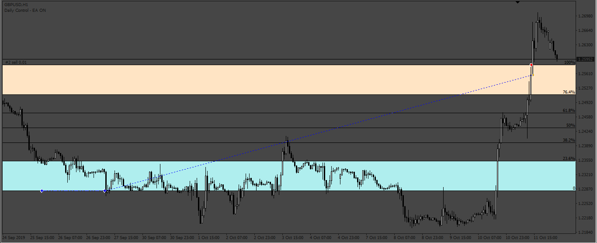
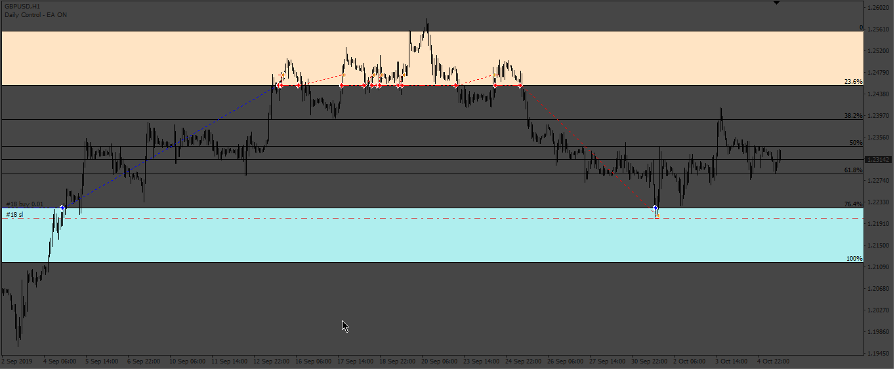

# AutoFiboTZ_EA

> Source: https://fxcodebase.com/code/viewtopic.php?f=38&t=72944  
> Forum: 38 · Topic 72944 · 8 post(s)

---

## AutoFiboTZ_EA

**Apprentice** · Mon Nov 14, 2022 4:38 pm

Based on the request.
[https://fxcodebase.com/code/viewtopic.php?f=27&p=148255](https://fxcodebase.com/code/viewtopic.php?f=27&p=148255)

 [AutoFib_TradeZones.mq4](files/148332/AutoFib_TradeZones.mq4)

 [AutoFiboTZ_EA.mq4](files/148332/AutoFiboTZ_EA.mq4)

---

## Re: AutoFiboTZ_EA

**Sensible** · Tue Nov 15, 2022 12:15 am

Thanks Apprentice,

I am grateful for approving the request of this EA and the development of it.

Please I will like to make correction to this AutoFibs TZ_EA its not working according to plans Sir.

The auto Fibonacci tradezone plots the retracement levels between 0 and 100%. If the market is bearish, the zero is at the top and 100 points at the bottom and vice versa. Essentially, after reaching a new high, the market tends to retrace up to the various Fibonacci retracement level. Since Price doesn't usually reversed or rebounds at 23.6% & 76.4% Fibonacci level depending on it current direction which is my area trade target. I will like to put BUY STOP & SELL STOP (breakout/cross) at 23.6% & 76.4% Fibonacci level depending on it current direction.

Also help to include the period of autofibs on the input parameter so that I can reduce it from 240 period And with a simple input to understand and used

Please Help me to correct this.

---

## Re: AutoFiboTZ_EA

**Sensible** · Tue Nov 15, 2022 2:12 am

Please Note that Opening of BUY should be at the exit of Buy TradeZone and SELL Should be at the exit of Sell TradeZone

while that of Closing of BUY should be at the entry Sell TradeZone and SELL should be at entry of Buy TradeZone.

Thanks

---

## Re: AutoFiboTZ_EA

**Apprentice** · Tue Nov 15, 2022 3:52 am

We have added your request to the development list.
Development reference 752.

---

## Re: AutoFiboTZ_EA

**Apprentice** · Thu Nov 24, 2022 3:07 am

Try this version.

 [AutoFiboTZ_EA_v2.mq4](files/148432/AutoFiboTZ_EA_v2.mq4)

---

## Re: AutoFiboTZ_EA

**rickCreations** · Sat May 13, 2023 8:19 am

when backtesting version 1, after a few months it stops moving the the fibo lines. also in both versions getting order modify error: 1

---

## Re: AutoFiboTZ_EA

**Apprentice** · Sat May 13, 2023 11:44 am

We have added your request to the development list.
Development reference 428.

---

## Re: AutoFiboTZ_EA

**Apprentice** · Sat May 20, 2023 2:14 am

Try it now.
