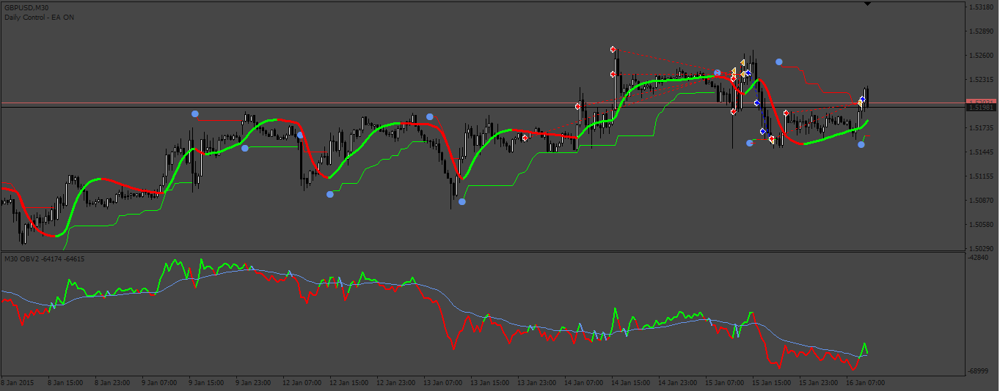
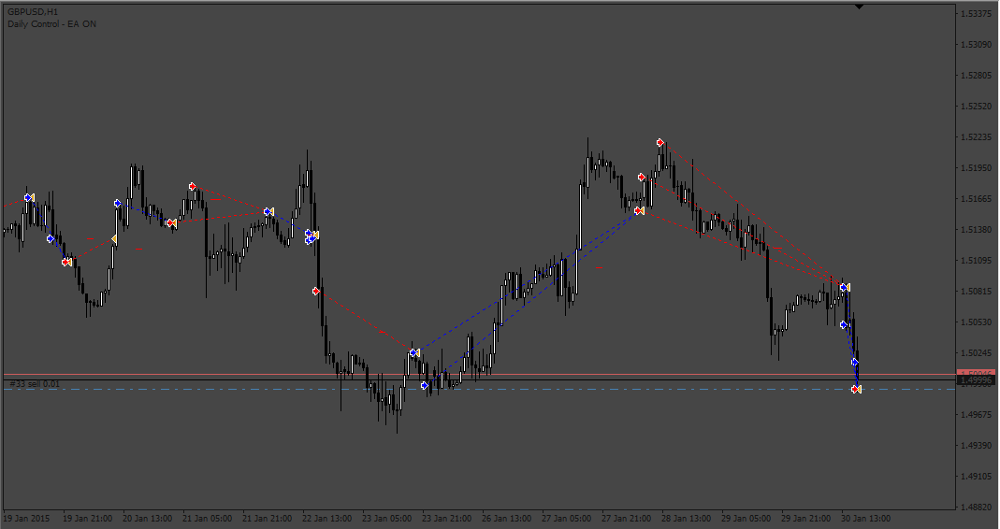
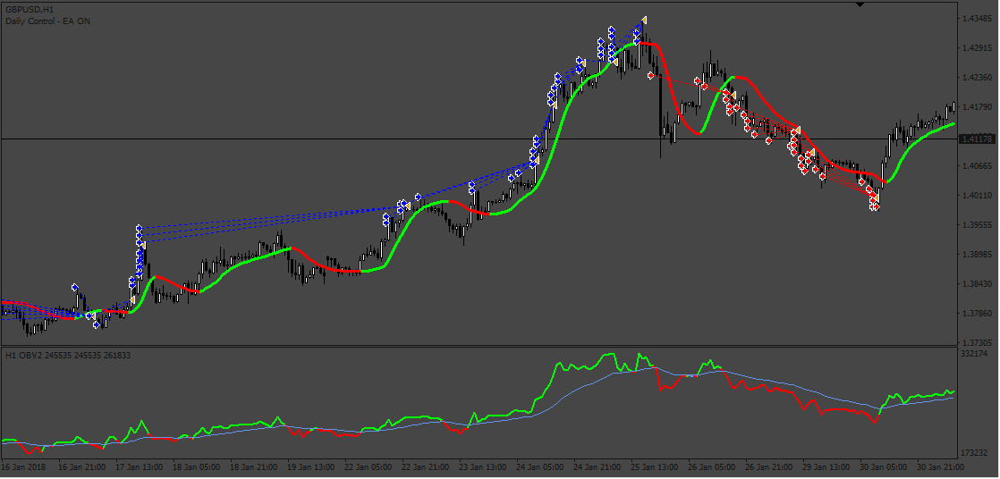

# Automate_JMA_and_OBV_strategy

> Source: https://fxcodebase.com/code/viewtopic.php?f=38&t=73717  
> Forum: 38 · Topic 73717 · 8 post(s)

---

## Automate_JMA_and_OBV_strategy

**Apprentice** · Sat May 13, 2023 10:51 am

Based on the request.
[https://fxcodebase.com/code/viewtopic.php?f=27&p=150713](https://fxcodebase.com/code/viewtopic.php?f=27&p=150713)

 [Automate_JMA_and_OBV_strategy.mq4](files/150826/Automate_JMA_and_OBV_strategy.mq4)

 [Jurik filter 1.02.mq4](files/150826/Jurik%20filter%201.02.mq4)

 [ATR_Stop.mq4](files/150826/ATR_Stop.mq4)

 [OBV2.02_mtf+alerts nmc.mq4](files/150826/OBV2.02_mtfalerts%20nmc.mq4)

---

## Re: Automate_JMA_and_OBV_strategy

**raikkoni** · Mon May 22, 2023 7:26 am

Thank you for the amazing code Apprentice.

I noticed a couple of things though,

Even if the grid distance is set to whatever number of pips, the orders are executed at the close of every candle. It'd be great if the EA can strictly follow a grid of stop orders at equal pips apart.

Also, for ATR stop loss, some of the orders in a series of buy/sell don't apply stop loss and stay open even if the condition reverses.

Could you please look into this and suggest if this can be modified?

---

## Re: Automate_JMA_and_OBV_strategy

**Apprentice** · Wed May 24, 2023 8:39 am

We have added your request to the development list.
Development reference 471.

---

## Re: Automate_JMA_and_OBV_strategy

**Apprentice** · Sat May 27, 2023 4:00 am

 [Automate_JMA_and_OBV_strategy_v2.mq4](files/151034/Automate_JMA_and_OBV_strategy_v2.mq4)

---

## Re: Automate_JMA_and_OBV_strategy

**raikkoni** · Wed Jun 07, 2023 12:40 am

Hi Apprentice, thank you again for the wonderful work!

A lot of discrepancies have been ironed out, only one concern is remaining now.

Currently, the EA takes buy/sell limit orders, that is, it creates a grid in the trend direction only if there is a pullback, instead, it should have a grid of stop orders to keep adding entries as the trend progresses.

Could you consider the grid to execute stop orders, not limit orders.

I plan to donate generously if this last condition is also worked out. Thank you again for looking into this and automating this complicated strategy

---

## Re: Automate_JMA_and_OBV_strategy

**Apprentice** · Thu Jun 15, 2023 5:18 am

We have added your request to the development list.
Development reference 520.

---

## Re: Automate_JMA_and_OBV_strategy

**Apprentice** · Tue Jun 20, 2023 12:55 pm

 [Automate_JMA_and_OBV_strategy_v3.mq4](files/151317/Automate_JMA_and_OBV_strategy_v3.mq4)

---

## Re: Automate_JMA_and_OBV_strategy

**WinnerFx** · Wed Aug 23, 2023 8:05 am

Is there a set file that’s profitable?
