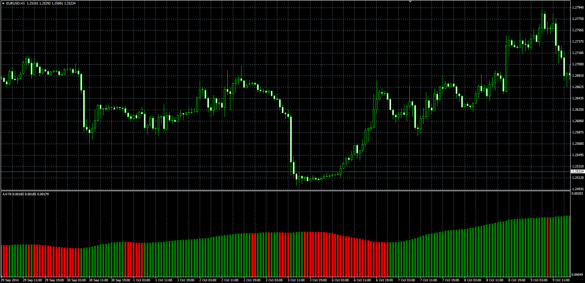

# Average Average True Range

> Source: https://fxcodebase.com/code/viewtopic.php?f=38&t=61477  
> Forum: 38 · Topic 61477 · 1 post(s)

---

## Average Average True Range

**Alexander.Gettinger** · Tue Nov 18, 2014 5:07 pm

Original LUA oscillator: [viewtopic.php?f=17&t=14414](https://fxcodebase.com/code/viewtopic.php?f=17&t=14414).

Formula:
AATR = MVA(ATR) with [MA_Length] number of periods, where
ATR - average true range with [ATR_Length] number of periods.

 

Download:

 [AATR.mq4](files/97182/AATR.mq4)
