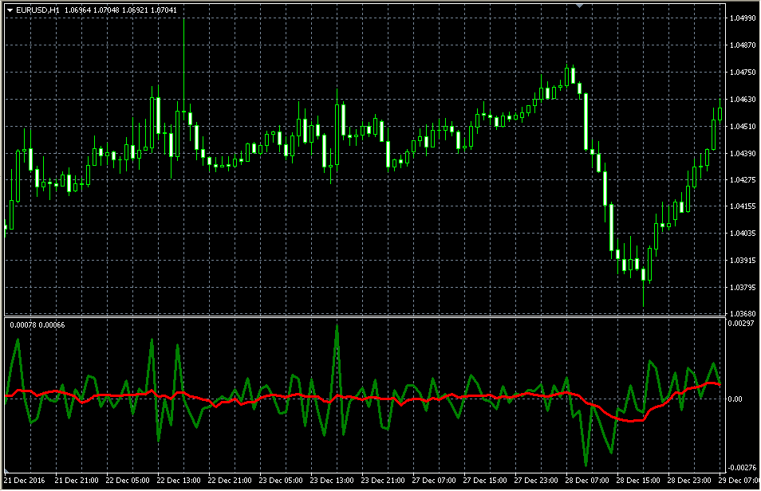

# Average change

> Source: https://fxcodebase.com/code/viewtopic.php?f=38&t=64335  
> Forum: 38 · Topic 64335 · 1 post(s)

---

## Average change

**Alexander.Gettinger** · Wed Jan 25, 2017 1:15 pm

Formula:
Average change[i]=MA(Price[i]-Price[i-1]), where
MA - moving average with [MA_Length] number of periods and [MA_Method] type.

 

Download:

 [Average_Change.mq4](files/110701/Average_Change.mq4)
