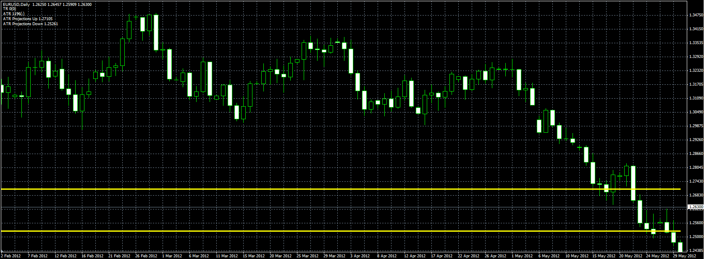

# Average Daily Range (ADR) Projection

> Source: https://fxcodebase.com/code/viewtopic.php?f=38&t=20224  
> Forum: 38 · Topic 20224 · 7 post(s)

---

## Average Daily Range (ADR) Projection

**Alexander.Gettinger** · Fri Jun 15, 2012 10:38 am

Original indicator: [viewtopic.php?f=17&t=2799](https://fxcodebase.com/code/viewtopic.php?f=17&t=2799)

> ADR Projections Up = low[period] + ADR[period];
> ADR Projections Down = high[period] - ADR[period];
>
> Daily Range
> DR = High[period] - Low [Period];
> ADR = AVG ( DR, Period);
> ATR is also supported, but is basically the same as ATR.

 

Download:

 [ADR_Projection.mq4](files/35550/ADR_Projection.mq4)

---

## Re: Average Daily Range (ADR) Projection

**Sepp64** · Fri Jun 15, 2012 11:27 am

This mq4 indicator does not work the way it should.
Attached you find an mq4 indicator that does exactly work like I want to have it.
Can this be done in .lua?

---

## Re: Average Daily Range (ADR) Projection

**Alexander.Gettinger** · Fri Jun 15, 2012 3:13 pm

The indicator is working properly.
It's just two different indicator.
I'll try to write your indicator for Marketscope.

---

## Re: Average Daily Range (ADR) Projection

**Jeffreyvnlk** · Mon Nov 05, 2012 2:05 pm

Could you make the horizontal line limited ? Just within that day and not running all over the chart ? Thank you

---

## Re: Average Daily Range (ADR) Projection

**Apprentice** · Tue Nov 06, 2012 7:13 am

Your request is added to the development list.

---

## Re: Average Daily Range (ADR) Projection

**Alexander.Gettinger** · Wed Nov 07, 2012 4:49 pm

> **Jeffreyvnlk wrote:**
> Could you make the horizontal line limited ? Just within that day and not running all over the chart ? Thank you

Indicator updated. Please, download it again.

---

## Re: Average Daily Range (ADR) Projection

**Jeffreyvnlk** · Mon Feb 11, 2013 8:58 pm

Thank you
