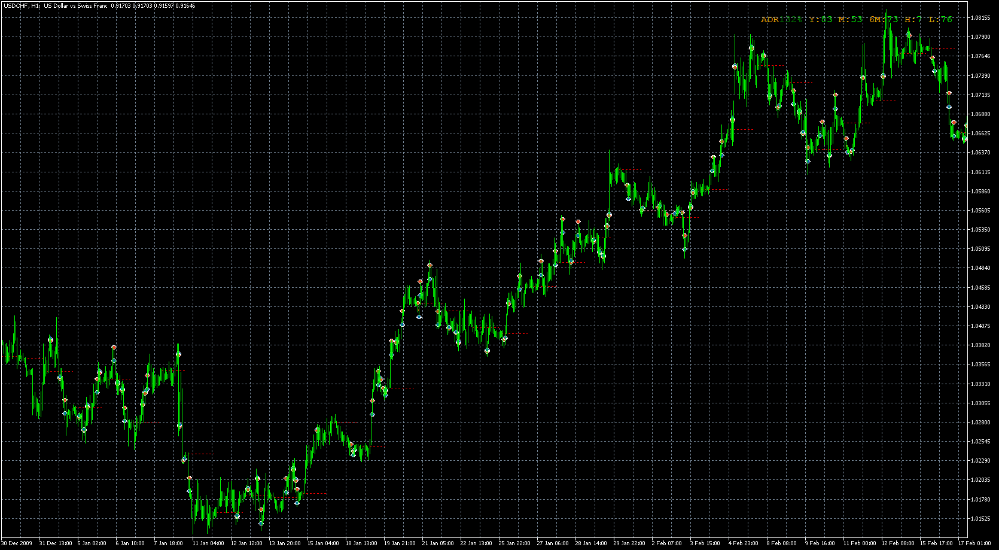
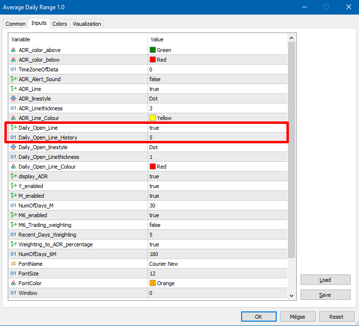
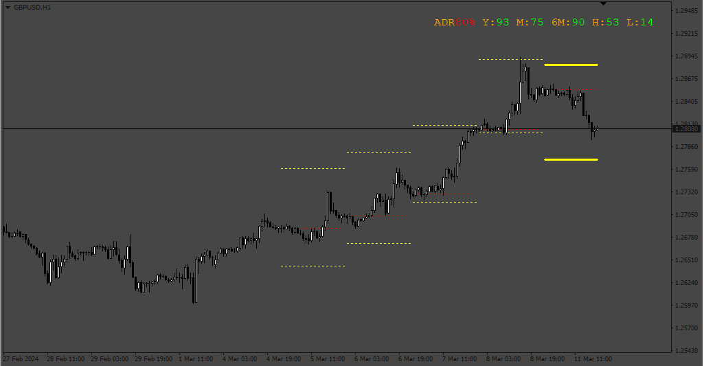
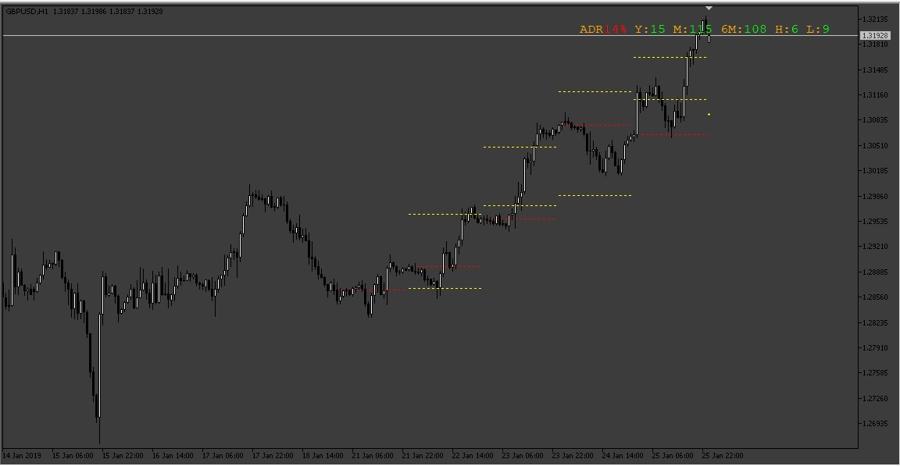
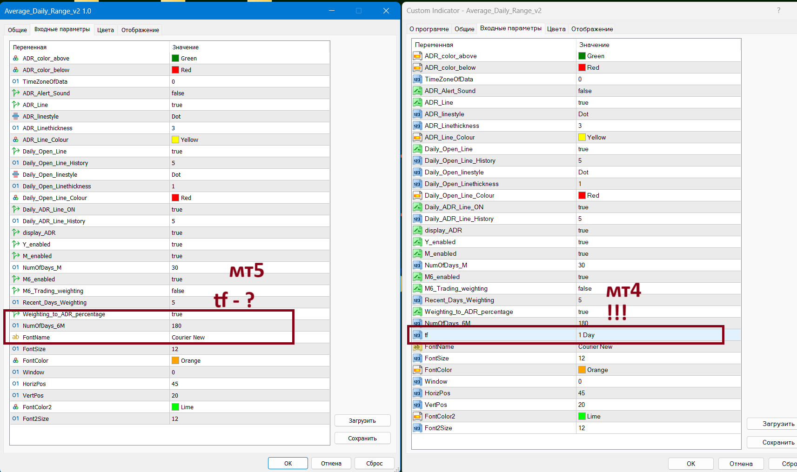
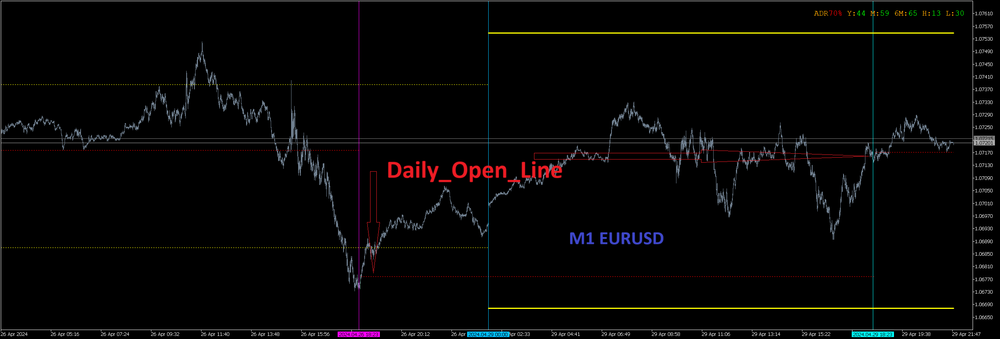
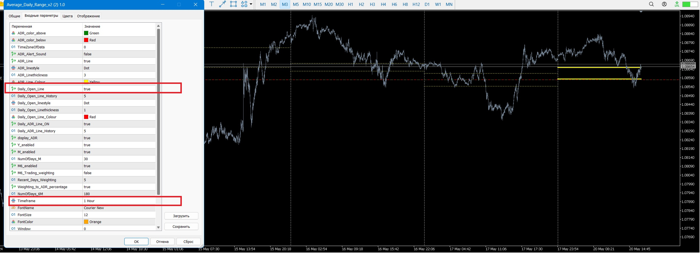

# Average Daily Range

> Source: https://fxcodebase.com/code/viewtopic.php?f=38&t=70582  
> Forum: 38 · Topic 70582 · 30 post(s)

---

## Average Daily Range

**Apprentice** · Thu Oct 29, 2020 11:57 am

Based on request.
[viewtopic.php?f=27&t=70578](https://fxcodebase.com/code/viewtopic.php?f=27&t=70578)

 [Average Daily Range.mq5](files/138558/Average%20Daily%20Range.mq5)

 [Average_Daily_Range.mq4](files/138558/Average_Daily_Range.mq4)

---

## Re: Average Daily Range

**logicgate** · Fri Oct 30, 2020 10:10 am

Thanks buddy, gonna test it now.

---

## Re: Average Daily Range

**logicgate** · Sat Oct 31, 2020 5:25 am

Tested and working perfectly now ,thanks!

---

## Re: Average Daily Range

**logicgate** · Thu Nov 05, 2020 9:29 am

Hi there buddy, you could compile two extra versions of this indicator by simply changing in the code which bar to use in the calculation. As of now it uses the daily bar as base for calculation.

You could compile one that uses the weekly bar and another that uses the monthly bar, so we will get:

Average Weekly Range (this one would be good to use in a hourly or 4hour chart)
Average Monthly Range (this one would be good to use in a daily chart)

---

## Re: Average Daily Range

**Apprentice** · Fri Nov 06, 2020 3:05 am

Your request is added to the development list.
Development reference 2260.

---

## Re: Average Daily Range

**Apprentice** · Fri Nov 06, 2020 3:36 am

Timeframe parameter has been added

 [Average Daily Range.mq5](files/138702/Average%20Daily%20Range.mq5)

---

## Re: Average Daily Range

**logicgate** · Fri Nov 06, 2020 5:08 am

Brilliant gonna test it now, thanks!

---

## Re: Average Daily Range

**logicgate** · Mon Dec 20, 2021 12:48 pm

> **Apprentice wrote:**
> Timeframe parameter has been added
>
>
> Average Daily Range.mq5

Hi buddy, is it possible to add to the latest version of the indicator an option to show the ADR historically too? Like "X" days in the past?

Obviously when using another timeframe like weekly it would show "X" weeks in the past.

Best regards

---

## Re: Average Daily Range

**Apprentice** · Tue Dec 21, 2021 7:20 am

Your request is added to the development list.
Development reference 1029.

---

## Re: Average Daily Range

**logicgate** · Fri Apr 01, 2022 6:08 am

Hi there buddy! just checking if you did not forget about this... It was just an addition of historical ADR (show historical ADR lines in the last "X" days/weeks/months - whatever timeframe is set in settings). Best regards

---

## Re: Average Daily Range

**PhenomDC** · Sun Oct 16, 2022 6:16 am

Hello Apprentice, hope you're ok. MT4 version please?

---

## Re: Average Daily Range

**Apprentice** · Tue Oct 18, 2022 2:02 am

We have added your request to the development list.
Development reference 661.

---

## Re: Average Daily Range

**Apprentice** · Thu Oct 20, 2022 2:19 am

Average_Daily_Range.mq4 Added

---

## Re: Average Daily Range

**PhenomDC** · Fri Oct 21, 2022 12:29 am

Thanks bro

---

## Re: Average Daily Range

**logicgate** · Thu Jun 22, 2023 5:26 am

Dear friend Apprentice, it seems that you have forgotten the request to add the historical parameter to the indicator, remember?

Those are extra settings missing:

Show Historical Lines? Yes/No
Number of Historical Lines: (5 - default)

This way is possible to see how price behaved in relation to previous day ADR lines.

Best regards

---

## Re: Average Daily Range

**Apprentice** · Fri Jun 23, 2023 4:32 am

We have added your request to the development list.
Development reference 563.

---

## Re: Average Daily Range

**Apprentice** · Mon Jun 26, 2023 2:24 pm

 [Average_Daily_Range.mq5](files/151414/Average_Daily_Range.mq5)

 [Average_Daily_Range.mq4](files/151414/Average_Daily_Range.mq4)

---

## Re: Average Daily Range

**logicgate** · Tue Jun 27, 2023 6:55 am

Awesome!! Thanks a lot

---

## Re: Average Daily Range

**logicgate** · Thu Mar 07, 2024 6:31 am

> **Apprentice wrote:**
>
>
> image.png
>
>
>
>
> Average_Daily_Range.mq5
>
>
>
>
> Average_Daily_Range.mq4

Dear friend Apprentice.

You added historical setting to the wrong line, you added to the Daily Open line.

The historical lines to be displayed are the ADR high and low lines.

Best regards

---

## Re: Average Daily Range

**Apprentice** · Mon Mar 11, 2024 2:08 pm

 [Average_Daily_Range_v2.mq4](files/154644/Average_Daily_Range_v2.mq4)

---

## Re: Average Daily Range

**logicgate** · Mon Mar 18, 2024 4:50 am

brilliant, thanks buddy

---

## Re: Average Daily Range

**Neronc** · Fri Apr 26, 2024 5:18 pm

> **Apprentice wrote:**
>
>
> 209.png
>
>
>
>
> Average_Daily_Range_v2.mq4

Hello.
Average_Daily_Range_v2.mq4
Please - MT5.

---

## Re: Average Daily Range

**Apprentice** · Sat Apr 27, 2024 2:18 am

We have added your request to the development list.
Development reference 333

---

## Re: Average Daily Range

**Apprentice** · Mon Apr 29, 2024 9:38 am

 [Average_Daily_Range_v2.mq5](files/155180/Average_Daily_Range_v2.mq5)

---

## Re: Average Daily Range

**Neronc** · Mon Apr 29, 2024 2:07 pm

Hello.
Thank you!
But there is no the most important thing - a time frame switch.

 

And some other glitch.

 

---

## Re: Average Daily Range

**Apprentice** · Mon Apr 29, 2024 2:29 pm

We have added your request to the development list.
Development reference 349

---

## Re: Average Daily Range

**Apprentice** · Tue May 07, 2024 3:58 am

 [Average_Daily_Range_v2.mq5](files/155263/Average_Daily_Range_v2.mq5)

---

## Re: Average Daily Range

**Neronc** · Mon May 20, 2024 9:13 am

> **Apprentice wrote:**
>
>
> The attachment **101.png** is no longer available
>
>
>
>
> The attachment **101.png** is no longer available

Hello.
Thank you!
The time frame switch and the opening line of the day are not working...
H4=D1, H3=D1, H2=D1, H1,M30,M15.....=D1...
the opening line of the day - it may work, it may not work....

 

---

## Re: Average Daily Range

**Apprentice** · Wed May 22, 2024 1:51 pm

We have added your request to the development list.
Development reference 417

---

## Re: Average Daily Range

**Apprentice** · Sun Jul 13, 2025 1:28 pm

[Average_Daily_Range_v3_fixed.mq5](files/159904/Average_Daily_Range_v3_fixed.mq5)
