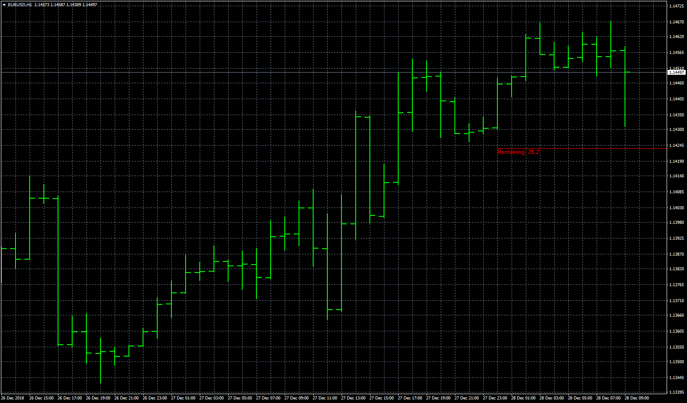

# Average Daily Range

> Source: https://fxcodebase.com/code/viewtopic.php?f=38&t=67213  
> Forum: 38 · Topic 67213 · 2 post(s)

---

## Average Daily Range

**Apprentice** · Fri Dec 28, 2018 6:32 am

Based on Lua/TS2 version.
[viewtopic.php?f=17&p=123055](https://fxcodebase.com/code/viewtopic.php?f=17&p=123055)

 [Average Daily Range.mq4](files/123068/Average%20Daily%20Range.mq4)

---

## Re: Average Daily Range

**logicgate** · Fri Dec 28, 2018 2:04 pm

Brilliant my friend!!
