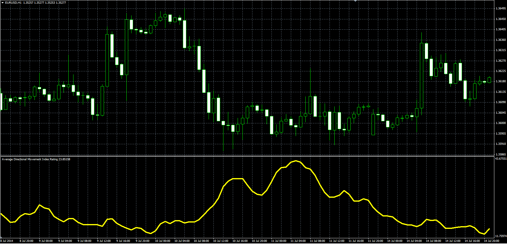

# Average Directional Movement Index Rating

> Source: https://fxcodebase.com/code/viewtopic.php?f=38&t=61044  
> Forum: 38 · Topic 61044 · 1 post(s)

---

## Average Directional Movement Index Rating

**Alexander.Gettinger** · Mon Aug 18, 2014 12:33 pm

Original LUA oscillator: [viewtopic.php?f=17&t=60198](https://fxcodebase.com/code/viewtopic.php?f=17&t=60198).

Formula:
ADMIR[i] = (ADX[i]+ADX[i-Difference])/2, where
ADX - Average Directional Movement Index with [Length] as number of periods.

 

Download:

 [ADMIR.mq4](files/95407/ADMIR.mq4)
