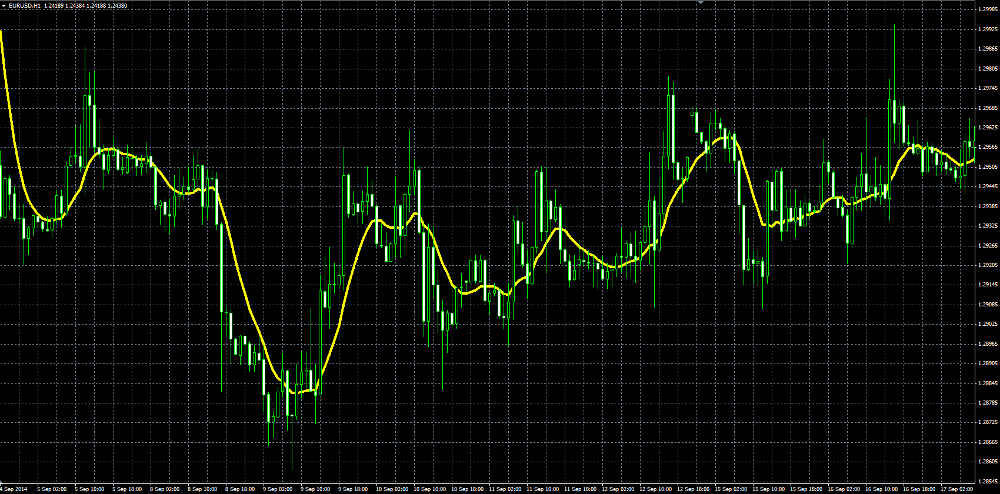

# Average from MA

> Source: https://fxcodebase.com/code/viewtopic.php?f=38&t=61547  
> Forum: 38 · Topic 61547 · 1 post(s)

---

## Average from MA

**Alexander.Gettinger** · Wed Nov 26, 2014 3:16 pm

The indicator is a average value from several MA.

For example:
if first period=5,
K=2,
Count of MA=5
Avg_MA=(MA(5)+MA(7)+MA(9)+MA(11)+MA(13))/5.

 

Download:

 [Avg_MA.mq4](files/97393/Avg_MA.mq4)
