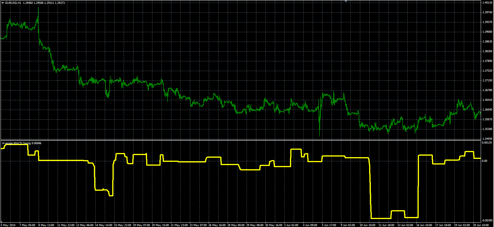

# Average MACD Swing

> Source: https://fxcodebase.com/code/viewtopic.php?f=38&t=61151  
> Forum: 38 · Topic 61151 · 1 post(s)

---

## Average MACD Swing

**Alexander.Gettinger** · Mon Sep 15, 2014 12:15 pm

Original LUA oscillator: [viewtopic.php?f=17&t=36070](https://fxcodebase.com/code/viewtopic.php?f=17&t=36070).

 

Download:

 [AMS.mq4](files/95899/AMS.mq4)
