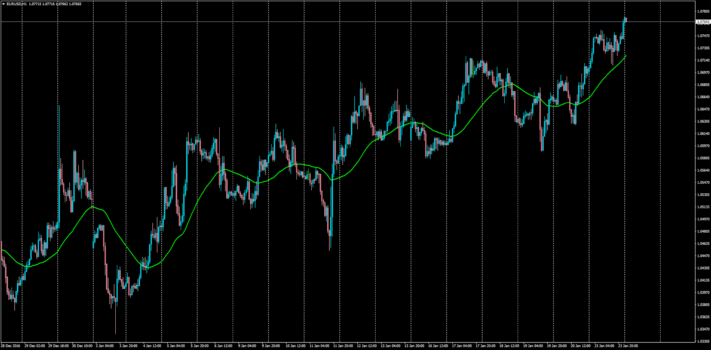

# Average of All Moving Averages

> Source: https://fxcodebase.com/code/viewtopic.php?f=38&t=64328  
> Forum: 38 · Topic 64328 · 1 post(s)

---

## Average of All Moving Averages

**Apprentice** · Tue Jan 24, 2017 1:25 pm

LUA Original: [viewtopic.php?f=17&t=2698](https://fxcodebase.com/code/viewtopic.php?f=17&t=2698)
Description:
Interesting study that calculates the average of all the distinct seventeen moving averages included in this indicator, by simply making the sum of every value and then dividing it by 17.

 [All_MA_Average.mq4](files/110682/All_MA_Average.mq4)
