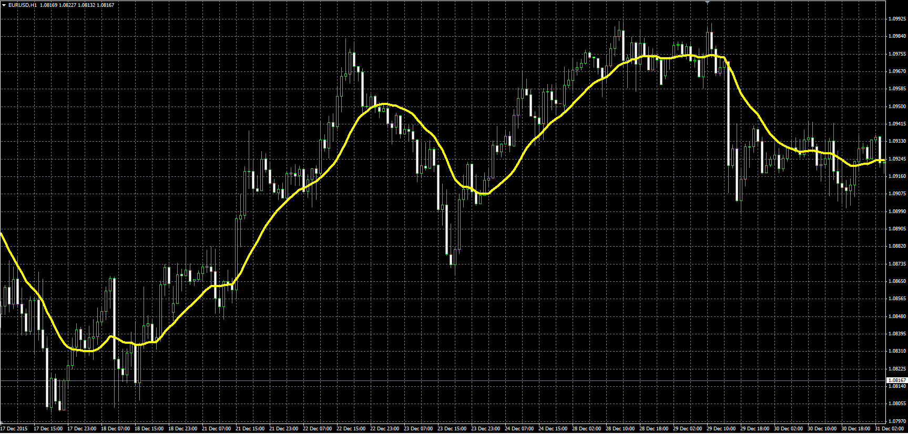

# Average of Averages Indicator

> Source: https://fxcodebase.com/code/viewtopic.php?f=38&t=63065  
> Forum: 38 · Topic 63065 · 3 post(s)

---

## Average of Averages Indicator

**Alexander.Gettinger** · Mon Jan 25, 2016 9:31 am

The indicator is average of 20 averages:
- Simple MA
- Exponential MA
- Wilder Exponential Moving Average ([viewtopic.php?f=38&t=59621&p=89894](https://fxcodebase.com/code/viewtopic.php?f=38&t=59621&p=89894))
- Linear Weighted Moving Average
- Sine Weighted Moving Average ([viewtopic.php?f=38&t=63064](https://fxcodebase.com/code/viewtopic.php?f=38&t=63064))
- Triangular Moving Average ([viewtopic.php?f=38&t=62775&p=102799](https://fxcodebase.com/code/viewtopic.php?f=38&t=62775&p=102799))
- Least Square Moving Average ([viewtopic.php?f=38&t=59628&p=89910](https://fxcodebase.com/code/viewtopic.php?f=38&t=59628&p=89910))
- Smoothed Moving Average
- Hull Moving Average ([viewtopic.php?f=38&t=59630&p=89912](https://fxcodebase.com/code/viewtopic.php?f=38&t=59630&p=89912))
- Zero-Lag Exponential Moving Average ([viewtopic.php?f=38&t=59634&p=102651](https://fxcodebase.com/code/viewtopic.php?f=38&t=59634&p=102651))

---

## Re: Average of Averages Indicator

**Alexander.Gettinger** · Mon Jan 25, 2016 9:31 am

- Double Exponential Moving Average ([viewtopic.php?f=38&t=20396&p=35764](https://fxcodebase.com/code/viewtopic.php?f=38&t=20396&p=35764))
- T3 ([viewtopic.php?f=38&t=63063](https://fxcodebase.com/code/viewtopic.php?f=38&t=63063))
- Instantaneous Trendline ([viewtopic.php?f=38&t=59635&p=89927](https://fxcodebase.com/code/viewtopic.php?f=38&t=59635&p=89927))
- Median Moving Median ([viewtopic.php?f=38&t=20876&p=36565](https://fxcodebase.com/code/viewtopic.php?f=38&t=20876&p=36565))
- Geometric Mean ([viewtopic.php?f=38&t=20877&p=36566](https://fxcodebase.com/code/viewtopic.php?f=38&t=20877&p=36566))
- Regularized EMA ([viewtopic.php?f=38&t=59636&p=89928](https://fxcodebase.com/code/viewtopic.php?f=38&t=59636&p=89928))
- Integral of Linear Regression Slope ([viewtopic.php?f=38&t=59963&p=91097](https://fxcodebase.com/code/viewtopic.php?f=38&t=59963&p=91097))
- IE/2 moving average ([viewtopic.php?f=38&t=59964&p=91098](https://fxcodebase.com/code/viewtopic.php?f=38&t=59964&p=91098))
- TriMAgen ([viewtopic.php?f=38&t=59965&p=91099](https://fxcodebase.com/code/viewtopic.php?f=38&t=59965&p=91099))
- JSmooth moving average ([viewtopic.php?f=38&t=59966&p=91100](https://fxcodebase.com/code/viewtopic.php?f=38&t=59966&p=91100))

---

## Re: Average of Averages Indicator

**Alexander.Gettinger** · Mon Jan 25, 2016 9:33 am

All of these indicators should be installed for correct work.

 

Download:

 [Average_Of_Averages.mq4](files/104420/Average_Of_Averages.mq4)
