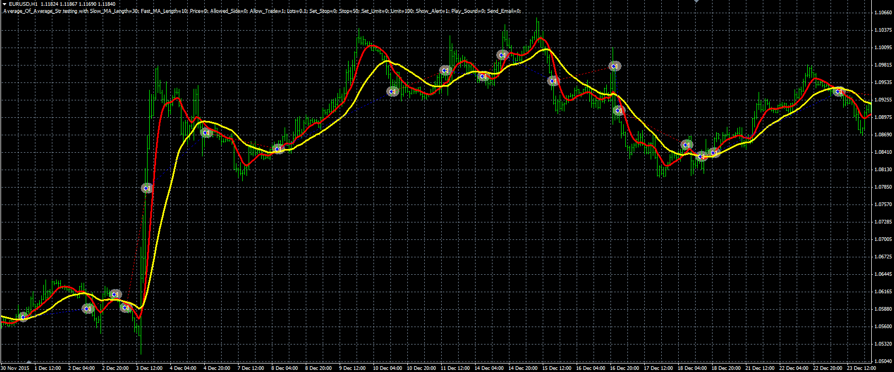

# Average of Averages Strategy

> Source: https://fxcodebase.com/code/viewtopic.php?f=38&t=63278  
> Forum: 38 · Topic 63278 · 1 post(s)

---

## Average of Averages Strategy

**Alexander.Gettinger** · Wed Mar 23, 2016 11:54 am

The strategy based on Average Of Average indicator ([viewtopic.php?f=38&t=63065](https://fxcodebase.com/code/viewtopic.php?f=38&t=63065)).

Buy condition: Fast Average Of Average indicator crosses over Slow Average Of Average indicator.
Sell condition: Fast Average Of Average indicator crosses under Slow Average Of Average indicator.

 

Download:

 [Average_Of_Average_Str.mq4](files/105413/Average_Of_Average_Str.mq4)

Average Of Average indicator ([viewtopic.php?f=38&t=63065](https://fxcodebase.com/code/viewtopic.php?f=38&t=63065)) should be installed for correct work.
