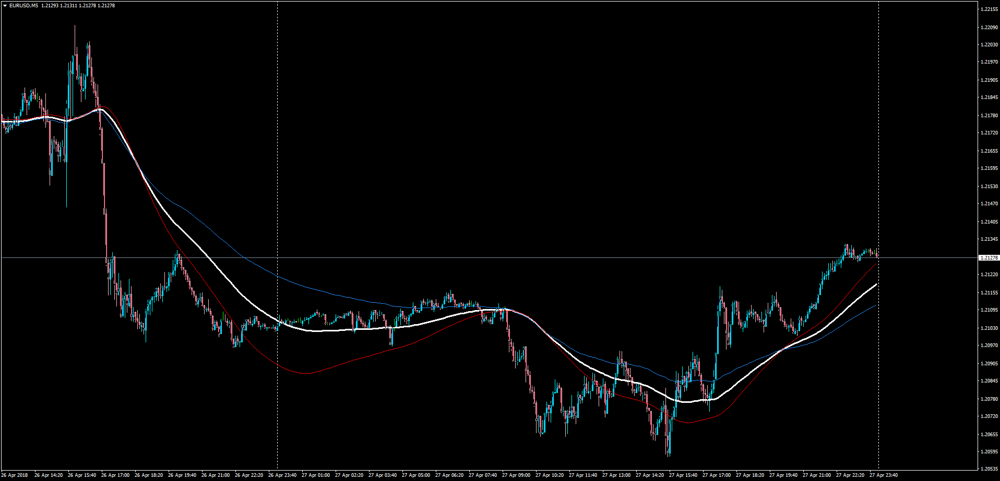

# Average of Two Averages

> Source: https://fxcodebase.com/code/viewtopic.php?f=38&t=65973  
> Forum: 38 · Topic 65973 · 1 post(s)

---

## Average of Two Averages

**Apprentice** · Mon Apr 30, 2018 5:03 pm

LUA Original: [viewtopic.php?f=17&t=9508](https://fxcodebase.com/code/viewtopic.php?f=17&t=9508)

Description:

MT4 version of the LUA Original indicator which gives you a choice to select two moving averages from 17 different types.

It calculates the average values ​​of these two moving averages.

Avg = (Avg1 + Avg2 ) / 2

 [Average_of_Two_Averages.mq4](files/118896/Average_of_Two_Averages.mq4)
