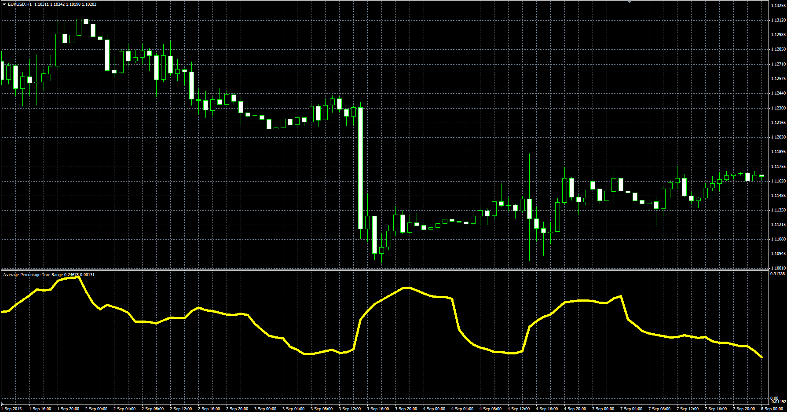

# Average Percentage True Range

> Source: https://fxcodebase.com/code/viewtopic.php?f=38&t=62824  
> Forum: 38 · Topic 62824 · 1 post(s)

---

## Average Percentage True Range

**Alexander.Gettinger** · Fri Oct 23, 2015 12:09 pm

This indicator has been described in the Stock&Commodities (November 2015).

 

Download:

 [APTR.mq4](files/103000/APTR.mq4)

Version with different smoothing methods:

 [APTR_MA.mq4](files/103000/APTR_MA.mq4)
