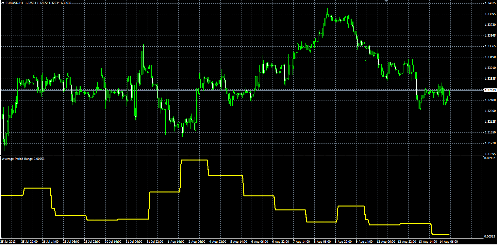

# Average Period Range

> Source: https://fxcodebase.com/code/viewtopic.php?f=38&t=59129  
> Forum: 38 · Topic 59129 · 1 post(s)

---

## Average Period Range

**Alexander.Gettinger** · Wed Aug 14, 2013 3:07 pm

Original LUA oscillator: [http://fxcodebase.com/code/viewtopic.php?f=17&t=38110](https://fxcodebase.com/code/viewtopic.php?f=17&t=38110).

 

Download:

 [APR.mq4](files/88584/APR.mq4)
