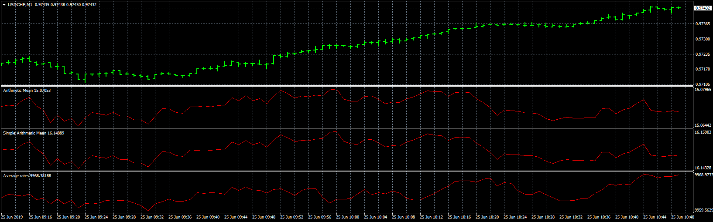

# Average rates

> Source: https://fxcodebase.com/code/viewtopic.php?f=38&t=68601  
> Forum: 38 · Topic 68601 · 1 post(s)

---

## Average rates

**Apprentice** · Tue Jun 25, 2019 4:44 am

Based on FXCM TS2/Lua original
[viewtopic.php?f=17&t=66105](https://fxcodebase.com/code/viewtopic.php?f=17&t=66105)

 [Simple Arithmetic Mean.mq4](files/127092/Simple%20Arithmetic%20Mean.mq4)

 [Arithmetic Mean.mq4](files/127092/Arithmetic%20Mean.mq4)

 [Average rates.mq4](files/127092/Average%20rates.mq4)
