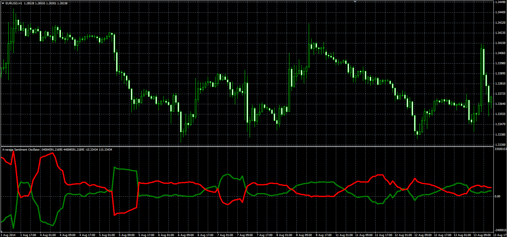

# Average Sentiment Oscillator

> Source: https://fxcodebase.com/code/viewtopic.php?f=38&t=61229  
> Forum: 38 · Topic 61229 · 1 post(s)

---

## Average Sentiment Oscillator

**Alexander.Gettinger** · Tue Sep 23, 2014 10:23 am

Original LUA oscillator: [viewtopic.php?f=17&t=27860](https://fxcodebase.com/code/viewtopic.php?f=17&t=27860).

Formulas:
Bulls = MA(Bu) with [Smoothing_Length] number of periods and [MA_Method] type,
Bears = MA(Be) with [Smoothing_Length] number of periods and [MA_Method] type, where
For Combined Mode:
Bu = (IBu+GBu)/2,
Be = (IBe+GBe)/2,
For Intra-bar Mode:
Bu = IBu,
Be = IBe,
For Group Algorithm Mode:
Bu = GBu,
Be = GBe.
For All Modes:
IBu = 50*(Close-Low+High-Open)/(High-Low),
IBe = 50*(High-Close+Open-Low)/(High-Low),
GBu = 50*(Close-GL+GH-GO)/(GH-GL),
GBe = 50*(GH-Close+GO-GL)/(GH-GL),
GO[i] = Open[i-Range_Length],
GL[i] - minimum value of High price at range from (i-Range_Length+1) to (i),
GH[i] - maximum value of Low price at range from (i-Range_Length+1) to (i).

 

Download:

 [ASO.mq4](files/96121/ASO.mq4)
