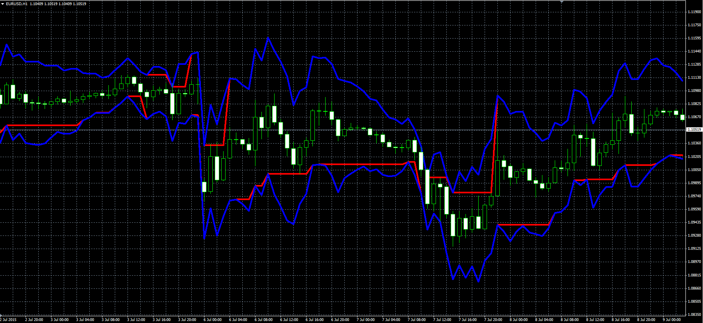

# Average True Range Bands

> Source: https://fxcodebase.com/code/viewtopic.php?f=38&t=62488  
> Forum: 38 · Topic 62488 · 1 post(s)

---

## Average True Range Bands

**Alexander.Gettinger** · Wed Jul 29, 2015 7:46 am

Original LUA indicator: [viewtopic.php?f=17&t=62435](http://www.fxcodebase.com/code/viewtopic.php?f=17&t=62435).

 

Download:

 [Average_True_Range_Bands.mq4](files/101597/Average_True_Range_Bands.mq4)
