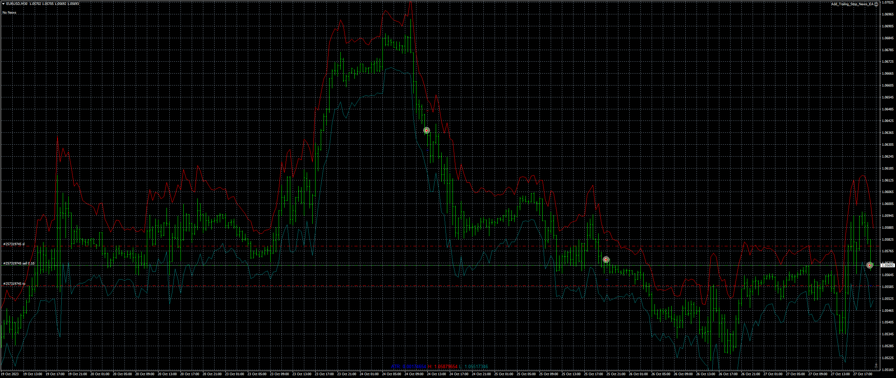

# Average_True_Range_Stop_Loss_Finder

> Source: https://fxcodebase.com/code/viewtopic.php?f=38&t=74295  
> Forum: 38 · Topic 74295 · 1 post(s)

---

## Average_True_Range_Stop_Loss_Finder

**Apprentice** · Fri Oct 27, 2023 12:31 pm

Based on the request.
[https://fxcodebase.com/code/viewtopic.php?f=27&p=152324](https://fxcodebase.com/code/viewtopic.php?f=27&p=152324)

 [Average_True_Range_Stop_Loss_Finder.mq4](files/153110/Average_True_Range_Stop_Loss_Finder.mq4)
