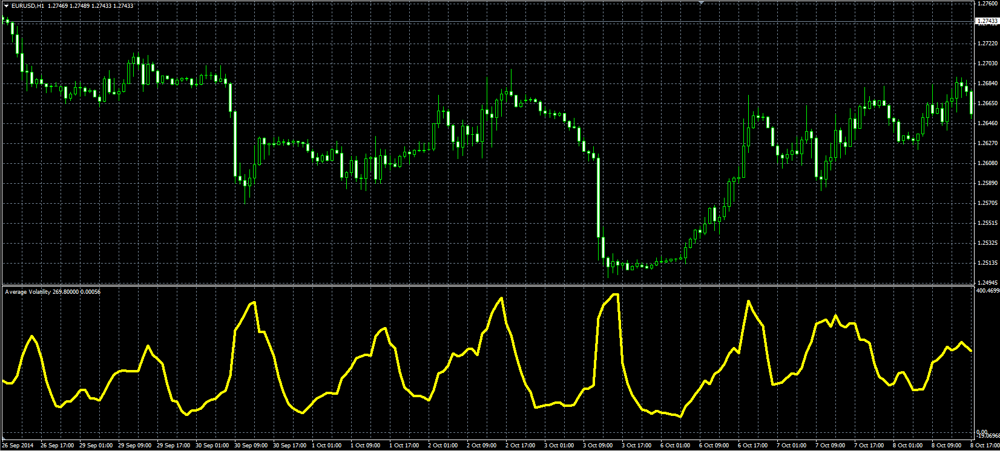

# Average Volatility

> Source: https://fxcodebase.com/code/viewtopic.php?f=38&t=61457  
> Forum: 38 · Topic 61457 · 1 post(s)

---

## Average Volatility

**Alexander.Gettinger** · Mon Nov 17, 2014 5:26 pm

Original LUA oscillator: [viewtopic.php?f=17&t=22435](https://fxcodebase.com/code/viewtopic.php?f=17&t=22435).

Formulas:
AV = MVA(Volatility) with [Length] number of periods, where
Volatility = High - Low.

 

Download:

 [AV.mq4](files/97132/AV.mq4)
