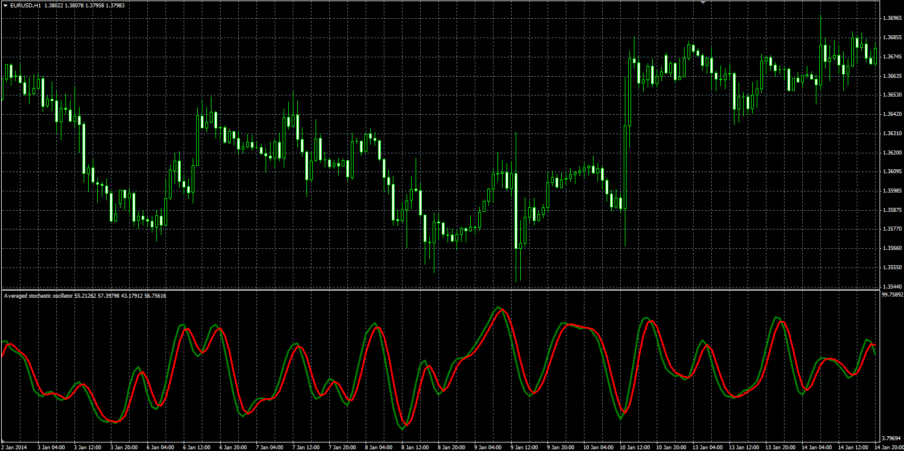

# Averaged stochastic oscillator

> Source: https://fxcodebase.com/code/viewtopic.php?f=38&t=60388  
> Forum: 38 · Topic 60388 · 1 post(s)

---

## Averaged stochastic oscillator

**Alexander.Gettinger** · Mon Mar 03, 2014 9:43 am

The indicator shows the average values ​​of the stochastic.

Formulas:
K = MVA(Stochastic.K, Avg. period),
D = MVA(Stochastic.D, Avg. period).

 

Download:

 [Avg_Stoch.mq4](files/92987/Avg_Stoch.mq4)
