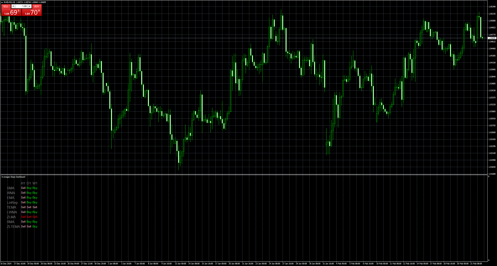
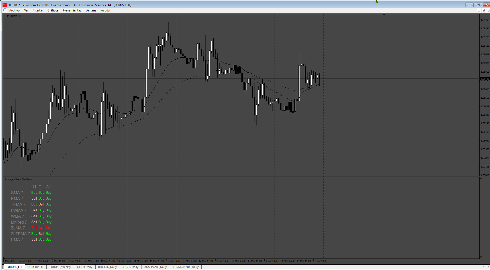

# Averages_Slope_Dashboard

> Source: https://fxcodebase.com/code/viewtopic.php?f=38&t=75640  
> Forum: 38 · Topic 75640 · 10 post(s)

---

## Averages_Slope_Dashboard

**Apprentice** · Mon Feb 24, 2025 5:29 am

Based on the request.
[https://fxcodebase.com/code/viewtopic.php?f=38&t=75636](https://fxcodebase.com/code/viewtopic.php?f=38&t=75636)

 [Averages_Slope_Dashboard.mq4](files/158373/Averages_Slope_Dashboard.mq4)

---

## Re: Averages_Slope_Dashboard

**Kinslay** · Mon Feb 24, 2025 1:17 pm

Hi Apprentice,

Thanks for the work.
The indicator seems to be ok, but in the settings it doesn't give me the possibility to enter more periods.
In my dashboard I would like to see 3 or 4 averages of different periods, while in the indicator you created I have the possibility of seeing only one period.
In the image I attach there is an example of what I would like to see, is it possible?

Regards

---

## Re: Averages_Slope_Dashboard

**Kinslay** · Mon Feb 24, 2025 1:22 pm

in addition to the previous post, on the ordinate axis I would like to see the time frames while on the abscissa axis the periods of the different averages and not vice versa.

Regards

---

## Re: Averages_Slope_Dashboard

**Apprentice** · Tue Mar 04, 2025 5:53 am

We have added your request to the development list.
Development reference 163

---

## Re: Averages_Slope_Dashboard

**Apprentice** · Thu Mar 06, 2025 2:51 pm

[Averages_Slope_Dashboard.mq4](files/158498/Averages_Slope_Dashboard.mq4)

Try this version.

---

## Re: Averages_Slope_Dashboard

**Kinslay** · Fri Mar 07, 2025 2:09 pm

Hello,

The file is not working on mt4, pls can you fix the code?

Regards

---

## Re: Averages_Slope_Dashboard

**Apprentice** · Mon Mar 10, 2025 2:40 pm

Try it now.

---

## Re: Averages_Slope_Dashboard

**Kinslay** · Mon Mar 10, 2025 3:13 pm

Not working, attached the errors and warning i see on my mt4.
Can you fix?

Regards

---

## Re: Averages_Slope_Dashboard

**Apprentice** · Thu Mar 13, 2025 5:34 am

We have added your request to the development list.
Development reference 195

---

## Re: Averages_Slope_Dashboard

**Apprentice** · Sun Mar 16, 2025 1:28 pm

 [Averages_Slope_Dashboard.mq4](files/158632/Averages_Slope_Dashboard.mq4)
