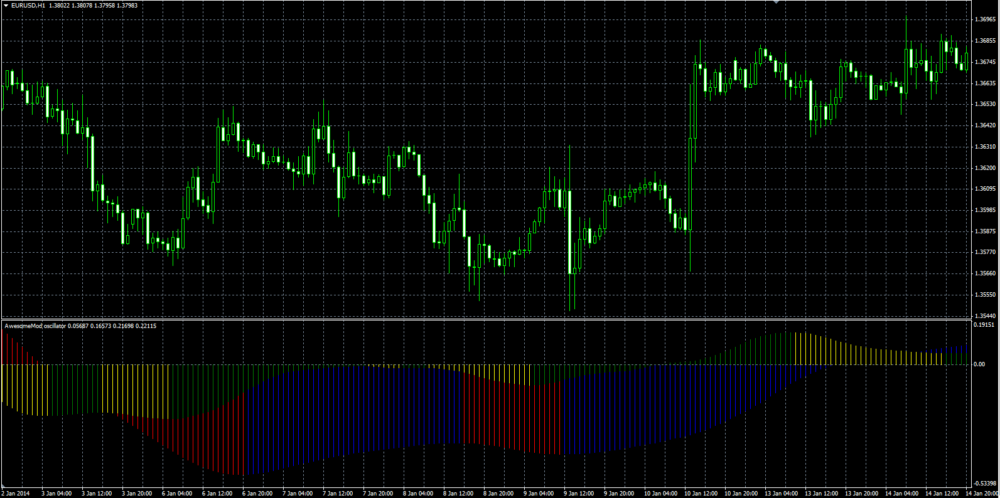

# Awesome Modified

> Source: https://fxcodebase.com/code/viewtopic.php?f=38&t=60390  
> Forum: 38 · Topic 60390 · 1 post(s)

---

## Awesome Modified

**Alexander.Gettinger** · Mon Mar 03, 2014 9:55 am

Original LUA oscillator: [viewtopic.php?f=17&t=60389](https://fxcodebase.com/code/viewtopic.php?f=17&t=60389).

Formulas:
AO_Fast = MVA(100*(Short_EMA/Medium_EMA-1), AO_Fast_Length),
AO_Slow = MVA(100*(Medium_EMA/Long_EMA-1), AO_Slow_Length).

 

Download:

 [AwesomeMod.mq4](files/92990/AwesomeMod.mq4)
