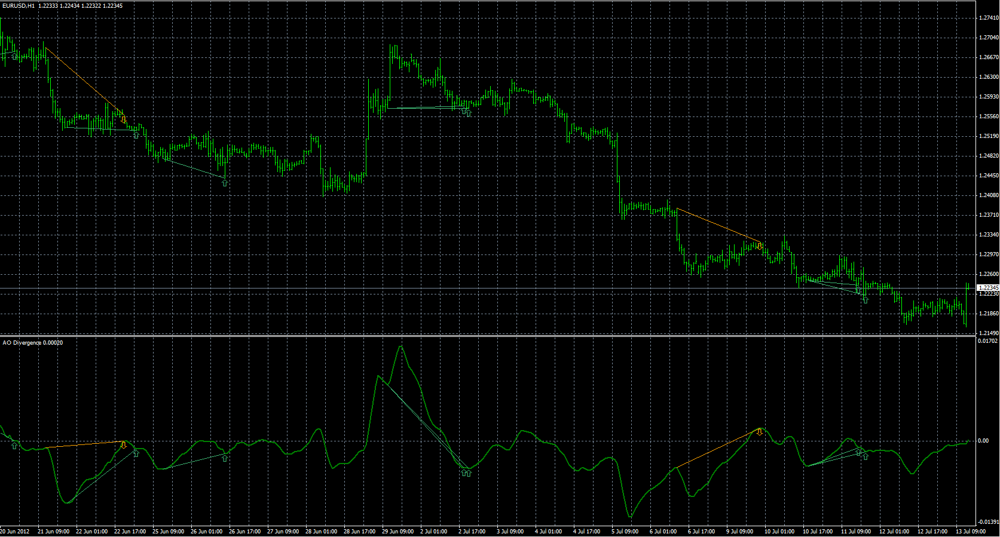

# Awesome oscillator divergence indicator

> Source: https://fxcodebase.com/code/viewtopic.php?f=38&t=21031  
> Forum: 38 · Topic 21031 · 1 post(s)

---

## Awesome oscillator divergence indicator

**Alexander.Gettinger** · Fri Jul 13, 2012 9:24 am

The indicator shows AO, AO divergence lines and trend lines on the prices.

 

Download:

 [AO_Divergence.mq4](files/36858/AO_Divergence.mq4)
