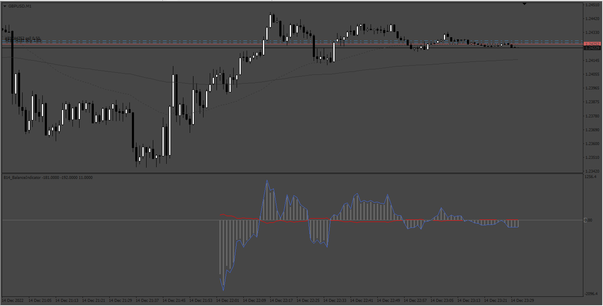

# Balance Indicator

> Source: https://fxcodebase.com/code/viewtopic.php?f=38&t=73054  
> Forum: 38 · Topic 73054 · 5 post(s)

---

## Balance Indicator

**Apprentice** · Fri Dec 16, 2022 10:58 am

Based on request.
[https://fxcodebase.com/code/viewtopic.php?f=17&t=73037](https://fxcodebase.com/code/viewtopic.php?f=17&t=73037)

 [Balance Indicator.mq4](files/148698/Balance%20Indicator.mq4)

---

## Re: Balance Indicator

**BobbyFX** · Sun Dec 18, 2022 2:01 pm

Thank you very much but I think I may be missing something as the graph doesn't show anything when used with the strategy tester. i created a small random trade generator for testing, ran my EA over the past month to get a chart then attached the balance indicator to it but dont see a graph - any ideas?

---

## Re: Balance Indicator

**BobbyFX** · Tue Dec 27, 2022 12:58 pm

> **BobbyFX wrote:**
> Thank you very much but I think I may be missing something as the graph doesn't show anything when used with the strategy tester. i created a small random trade generator for testing, ran my EA over the past month to get a chart then attached the balance indicator to it but dont see a graph - any ideas?

Hello - does this indicator work on the mt4 stretegy tester as above?

Thanks

---

## Re: Balance Indicator

**Apprentice** · Fri Dec 30, 2022 4:23 am

We have added your request to the development list.
Development reference 870.

---

## Re: Balance Indicator

**Apprentice** · Fri Aug 01, 2025 6:01 am

[Balance_Indicator_v2.mq4](files/160099/Balance_Indicator_v2.mq4)

Try this version.
