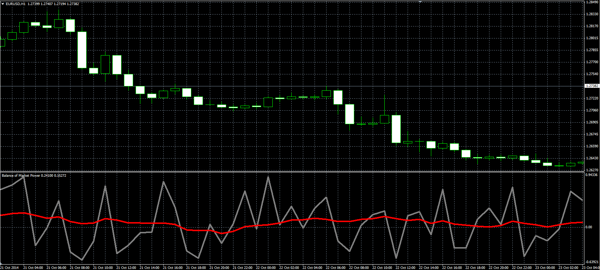

# Balance of Market Power

> Source: https://fxcodebase.com/code/viewtopic.php?f=38&t=61448  
> Forum: 38 · Topic 61448 · 1 post(s)

---

## Balance of Market Power

**Alexander.Gettinger** · Mon Nov 17, 2014 4:52 pm

Original LUA oscillator: [viewtopic.php?f=17&t=23534](https://fxcodebase.com/code/viewtopic.php?f=17&t=23534).

Formulas:
BMP = (BuO+BuC+BuOC)/3-(BeO+BeC+BeOC)/3,
Signal = MVA(BMP) with [Length] number of periods, where
BuO = (High-Low)/THL,
BeO = (Open-Low)/THL,
BuC = (Close-Low)/THL,
BeC = (High-Close)/THL,
BuOC = (Close-Open)/THL, if Close>Open, else BuOC = 0,
BeOC = (Open-Close)/THL, if Close<Open, else BeOC = 0,
THL = High-Low.

 

Download:

 [BMP.mq4](files/97114/BMP.mq4)
