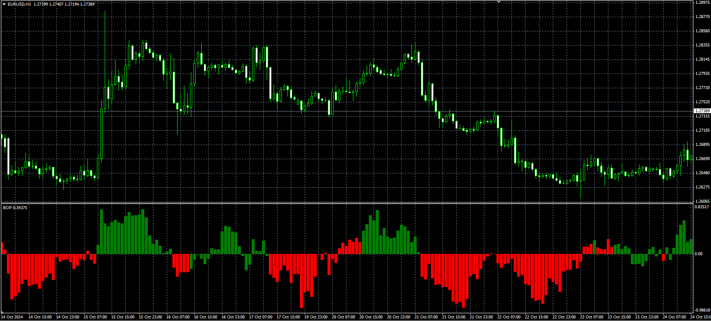

# Balance of Power

> Source: https://fxcodebase.com/code/viewtopic.php?f=38&t=61449  
> Forum: 38 · Topic 61449 · 1 post(s)

---

## Balance of Power

**Alexander.Gettinger** · Mon Nov 17, 2014 4:57 pm

Original LUA oscillator: [viewtopic.php?f=17&t=23491](https://fxcodebase.com/code/viewtopic.php?f=17&t=23491).

Formula:
BOP[i] = (Close[i] - Open[i-Price_Action+1])/(Max-Min), where
Max, Min - maximum and minimum prices at range from (i-Range_Length+1) to (i).

 

Download:

 [BOP.mq4](files/97116/BOP.mq4)
